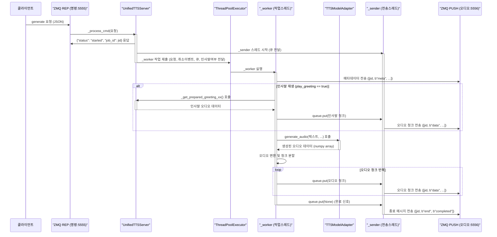
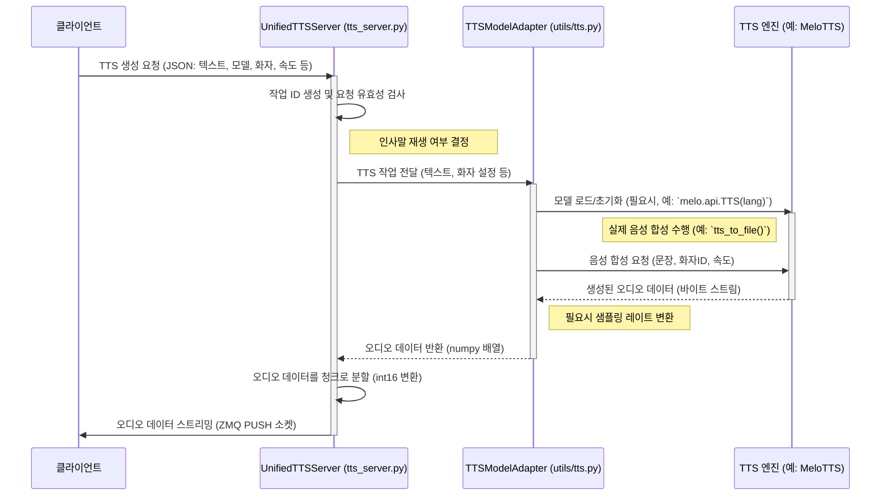

# Wiki Documentation for https://github.com/donggyun112/tts_server

Generated on: 2025-05-11 13:46:51

## Table of Contents

- [프로젝트 개요](#page-1)
- [서버 아키텍처](#page-2)
- [TTS 모델 연동](#page-3)
- [API 및 사용법](#page-4)
- [MeloTTS 상세 가이드](#page-5)
- [설치 및 설정](#page-6)

<a id='page-1'></a>

## 프로젝트 개요

### Related Files

- `README.md`
- `tts_server.py`
- `MeloTTS/README.md`

### Related Pages

Related topics: [서버 아키텍처](#page-2), [TTS 모델 연동](#page-3), [설치 및 설정](#page-6)

이 문서는 `donggyun112/tts_server` GitHub 저장소의 프로젝트 개요를 설명합니다. 프로젝트의 주요 목적, 핵심 기능, 구성 요소 및 이들 간의 상호작용 방식을 다룹니다.

## 1. 프로젝트 소개

`tts_server`는 다양한 텍스트 음성 변환(TTS) 엔진을 통합적으로 관리하고, ZeroMQ(ZMQ)를 통해 클라이언트에게 TTS 서비스를 제공하는 Python 기반 서버 애플리케이션입니다. 이 프로젝트는 특히 [MeloTTS](https://github.com/myshell-ai/MeloTTS)와 같은 고품질 다국어 TTS 모델을 백엔드에서 손쉽게 활용하여 스트리밍 음성 서비스를 구축하는 것을 목표로 합니다.

## 2. 목적 및 주요 기능

*   **통합 TTS 서비스 제공**: MeloTTS, KokoroTTS 등 여러 TTS 모델을 단일 인터페이스로 통합하여 제공합니다. (`tts_server.py`)
*   **비동기 처리**: 여러 클라이언트의 요청을 동시에 효율적으로 처리하기 위해 `ThreadPoolExecutor`를 활용한 비동기 방식을 사용합니다.
*   **실시간 스트리밍 지원**: 생성된 음성 데이터를 실시간으로 클라이언트에 스트리밍하여 사용자 경험을 향상시키고 응답 시간을 최소화합니다.
*   **유연한 TTS 설정**: 클라이언트는 요청 시 음성(화자), 속도, 목표 샘플링 속도 등 다양한 TTS 파라미터를 지정할 수 있습니다.
*   **인사말 기능**: 마지막 요청 이후 일정 시간이 경과하면, 다음 요청 시 자동으로 준비된 인사말 음성을 먼저 재생하여 자연스러운 상호작용을 유도합니다.
*   **확장 용이성**: 새로운 TTS 모델 어댑터를 추가하여 기능을 확장하기 용이한 추상화된 구조(`TTSModelAdapter`)를 가지고 있습니다.

## 3. 핵심 구성 요소

### 3.1. `tts_server.py`: 통합 TTS 서버

`tts_server.py`는 프로젝트의 핵심 로직을 담고 있는 메인 서버 스크립트입니다. ZMQ 소켓을 통해 클라이언트의 명령을 수신하고, TTS 작업을 관리하며, 생성된 오디오 데이터를 클라이언트로 전송하는 역할을 합니다.

*   **주요 기능**:
    *   **명령 수신 (ZMQ REP)**: `tcp://*:5555` 포트에서 클라이언트로부터 `generate` (음성 생성), `interrupt` (작업 중단), `list_voices` (사용 가능 화자 목록) 등의 JSON 형식 명령을 수신합니다.
    *   **오디오 전송 (ZMQ PUSH)**: `tcp://*:5556` 포트를 통해 생성된 오디오 데이터를 메타데이터와 함께 청크(chunk) 단위로 클라이언트에 푸시(PUSH)합니다.
    *   **모델 어댑터 연동**: `MeloTTSAdapter` 또는 `KokoroTTSAdapter`와 같은 모델 어댑터를 통해 실제 음성 합성을 수행합니다.
    *   **동시 요청 처리**: `ThreadPoolExecutor`를 사용하여 여러 TTS 요청을 병렬로 처리합니다.
    *   **작업 관리**: 진행 중인 TTS 작업을 추적하고, 클라이언트의 중단 요청에 따라 작업을 취소할 수 있습니다.

*   **코드 예시: 서버 초기화 및 ZMQ 소켓 바인딩**
    ```python
    # File: tts_server.py
    class UnifiedTTSServer:
        def __init__(self, *, model_adapter: TTSModelAdapter, max_workers: int = 4):
            self.model_adapter = model_adapter
            self.DEFAULT_SR = model_adapter.default_sample_rate
            self.DEFAULT_CHUNK_SAMPLES = 1024
            
            self.ctx = zmq.Context()
            self.cmd_sock = self.ctx.socket(zmq.REP)
            self.cmd_sock.bind("tcp://*:5555")
            self.audio_sock = self.ctx.socket(zmq.PUSH)
            self.audio_sock.bind("tcp://*:5556")
            self.poller = zmq.Poller()
            self.poller.register(self.cmd_sock, zmq.POLLIN)
            
            self.executor = ThreadPoolExecutor(max_workers=max_workers)
            self.jobs: Dict[str, Dict[str, Any]] = {}
            # ... (생략) ...
    ```

*   **`tts_server.py` 내부 요청 처리 흐름도:**
    ```mermaid
         graph TD
             Client([Client]) --> CmdSock[Command Socket]
             CmdSock --> ProcessCmd[Process Command]
             ProcessCmd --> Executor[Thread Pool]
             Executor --> Worker[Worker]
             Worker --> Greeting[Greeting Generator]
             Worker --> ModelAdapter[TTS Model]
             ModelAdapter --> Worker
             Worker --> AudioQueue[Audio Queue]
             Sender[Sender Thread] --> AudioQueue
             Sender --> AudioSock[Audio Socket]
             AudioSock --> Client
    ```
<p>Sources: <a href="https://github.com/donggyun112/tts_server/blob/main/tts_server.py" target="_blank" rel="noopener noreferrer" class="mb-1 mr-1 inline-flex items-stretch font-mono text-xs !no-underline">tts_server.py</a></p>

### 3.2. `MeloTTS/README.md`: MeloTTS 라이브러리

MeloTTS는 MIT와 MyShell.ai에서 개발한 고품질 다국어 텍스트 음성 변환 라이브러리입니다. `tts_server`는 `MeloTTSAdapter`를 통해 이 라이브러리를 주요 TTS 엔진 중 하나로 사용하며, 다양한 언어와 음성 스타일을 지원합니다.

*   **주요 특징**:
    *   **다국어 및 다중 악센트 지원**: 한국어(KR), 영어(EN-US, EN-BR, EN-AU 등), 스페인어(ES), 프랑스어(FR), 중국어(ZH), 일본어(JP) 등 다양한 언어와 영어의 경우 여러 악센트를 지원합니다.
    *   **고품질 음성**: 자연스럽고 명료한 고품질의 음성을 생성합니다.
    *   **실시간 추론**: CPU 환경에서도 실시간 추론이 가능할 정도로 빠른 성능을 제공합니다.
    *   **다양한 사용 인터페이스**: Python API, 명령줄 인터페이스(CLI), 웹 UI(Gradio 기반)를 제공하여 사용 편의성을 높입니다.

*   **코드 예시: MeloTTS Python API를 사용한 한국어 음성 합성**
    ```python
    # MeloTTS/docs/install.md (Python API 예시)
    from melo.api import TTS

    # 속도 조절 가능
    speed = 1.0
    # 'auto'는 사용 가능한 경우 GPU를 자동 사용, 'cpu', 'cuda' 등으로 수동 설정 가능
    device = 'auto' 

    text = "안녕하세요! 오늘은 날씨가 정말 좋네요."
    # 한국어 모델 로드
    model = TTS(language='KR', device=device)
    speaker_ids = model.hps.data.spk2id # 사용 가능한 화자 ID 딕셔너리

    output_path = 'kr_example.wav'
    # 텍스트를 음성으로 변환하여 파일로 저장
    model.tts_to_file(text, speaker_ids['KR'], output_path, speed=speed)
    ```
<p>Sources: <a href="https://github.com/donggyun112/tts_server/blob/main/MeloTTS/README.md" target="_blank" rel="noopener noreferrer" class="mb-1 mr-1 inline-flex items-stretch font-mono text-xs !no-underline">MeloTTS/README.md</a>, <a href="https://github.com/donggyun112/tts_server/blob/main/MeloTTS/docs/install.md" target="_blank" rel="noopener noreferrer" class="mb-1 mr-1 inline-flex items-stretch font-mono text-xs !no-underline">MeloTTS/docs/install.md</a></p>

## 4. 전체 아키텍처 및 통합

`tts_server`는 클라이언트-서버 모델을 기반으로 작동합니다. 클라이언트는 ZMQ를 통해 `tts_server.py`에 음성 합성을 요청합니다. `tts_server.py`는 이 요청을 받아 적절한 TTS 모델 어댑터(예: `MeloTTSAdapter`)를 선택하고, 해당 어댑터는 실제 TTS 엔진(예: MeloTTS 라이브러리)을 사용하여 음성을 생성합니다. 생성된 음성 데이터는 다시 서버를 통해 클라이언트로 스트리밍됩니다.

*   **컴포넌트 간 상호작용 순서도:**
    ```mermaid
    sequenceDiagram
        participant C as 클라이언트
        participant S as UnifiedTTSServer (tts_server.py)
        participant MA as TTSModelAdapter (예: MeloTTSAdapter)
        participant ME as TTS Engine (예: MeloTTS 라이브러리)

        C->>S: TTS 요청 (JSON: generate 커맨드, 텍스트, 설정)
        activate S
        S->>S: 작업 ID 생성, 요청 유효성 검사
        S->>MA: 음성 생성 요청 (텍스트, 화자, 속도 등)
        activate MA
        MA->>ME: TTS 처리 요청 (내부 API 호출)
        activate ME
        ME-->>MA: 생성된 오디오 데이터 (raw, 예: numpy array)
        deactivate ME
        MA-->>S: 오디오 데이터 반환
        deactivate MA
        S->>S: 오디오 데이터 처리 (int16 변환, 청킹)
        loop 오디오 청크 전송
            S-->>C: 오디오 데이터 청크 (ZMQ PUSH, 스트리밍)
        end
        S-->>C: 종료 메시지 (예: "completed" 또는 "error")
        deactivate S
    ```
    이러한 구조를 통해 `tts_server`는 다양한 TTS 엔진을 유연하게 통합하고, 클라이언트에게 일관된 인터페이스로 TTS 서비스를 제공할 수 있습니다.

## 5. `README.md` (루트 저장소)

루트 저장소의 `README.md` 파일은 `tts_server` 프로젝트의 전반적인 소개, 설치 방법, 실행 방법, 그리고 기본적인 사용 예시를 제공하는 역할을 합니다. (주: 현재 분석 컨텍스트에 해당 파일의 구체적인 내용이 없어 일반적인 역할을 기술합니다.)

일반적으로 이 파일에는 다음과 같은 정보가 포함될 것으로 예상됩니다:
*   프로젝트의 목적 및 주요 기능 요약.
*   프로젝트 실행에 필요한 사전 요구사항 및 의존성 설치 안내 (예: Python 버전, ZMQ, 특정 TTS 라이브러리 등).
*   서버 실행 명령어 예시 (예: `python tts_server.py --model melo --device cpu`).
*   지원하는 TTS 모델 및 관련 설정 옵션에 대한 설명.
*   간단한 클라이언트 연동 예시 코드 또는 테스트 방법 안내.
<p>Sources: <a href="https://github.com/donggyun112/tts_server/blob/main/README.md" target="_blank" rel="noopener noreferrer" class="mb-1 mr-1 inline-flex items-stretch font-mono text-xs !no-underline">README.md</a></p>

---

<a id='page-2'></a>

## 서버 아키텍처

### Related Files

- `tts_server.py`

### Related Pages

Related topics: [프로젝트 개요](#page-1), [API 및 사용법](#page-4)

# 서버 아키텍처

## 소개

서버 아키텍처는 TTS (Text-to-Speech) 서버가 클라이언트의 요청을 처리하고, TTS 모델을 사용하여 음성을 생성하며, 생성된 오디오를 클라이언트에게 스트리밍하는 전체적인 구조와 흐름을 의미합니다. `tts_server.py` 파일은 이러한 기능을 수행하는 핵심 로직을 담고 있으며, 다양한 TTS 모델을 통합적으로 지원하도록 설계되었습니다.

## 목적 및 기능

`tts_server.py`의 `UnifiedTTSServer` 클래스는 다음과 같은 주요 목적과 기능을 가집니다:

*   **통합 TTS 인터페이스 제공**: MeloTTS, KokoroTTS 등 다양한 TTS 모델 어댑터를 통해 일관된 방식으로 음성 합성을 요청하고 결과를 받을 수 있도록 합니다.
*   **비동기 요청 처리**: `ThreadPoolExecutor`를 사용하여 여러 클라이언트의 음성 합성 요청을 동시에 효율적으로 처리합니다.
*   **ZMQ 기반 통신**:
    *   명령어 채널 (`tcp://*:5555`, `REP` 소켓): 클라이언트로부터 TTS 생성, 중단, 음성 목록 조회 등의 명령을 JSON 형식으로 수신하고 응답합니다.
    *   오디오 스트리밍 채널 (`tcp://*:5556`, `PUSH` 소켓): 생성된 오디오 데이터를 청크 단위로 클라이언트에게 푸시합니다.
*   **작업 관리**: 각 TTS 요청을 '작업(job)'으로 관리하며, 작업 ID를 통해 특정 작업을 중단할 수 있는 기능을 제공합니다.
*   **인사말 기능**: 일정 시간 동안 요청이 없다가 새로운 요청이 오면, 설정된 언어(한국어 또는 영어)에 따라 준비된 인사말 오디오를 먼저 전송합니다.
*   **실시간 스트리밍**: 생성된 오디오를 작은 청크로 나누어 실시간으로 스트리밍함으로써 사용자가 빠르게 음성을 들을 수 있도록 합니다.
*   **모델 관리**: TTS 모델의 초기화, 워밍업, 사용 가능한 음성 목록 제공 등의 기능을 수행합니다.

## 주요 구성 요소 및 흐름

### 1. 초기화 및 서버 시작

서버가 시작되면 `UnifiedTTSServer` 인스턴스가 생성되고, `initialize()` 메서드를 통해 선택된 TTS 모델 어댑터(`MeloTTSAdapter` 또는 `KokoroTTSAdapter`)를 초기화하고 워밍업합니다.

```python
# tts_server.py
class UnifiedTTSServer:
    def __init__(self, *, model_adapter: TTSModelAdapter, max_workers: int = 4):
        # 모델 어댑터 설정
        self.model_adapter = model_adapter
        
        # ZMQ 소켓 설정
        self.ctx = zmq.Context()
        self.cmd_sock = self.ctx.socket(zmq.REP)
        self.cmd_sock.bind("tcp://*:5555") # 명령어 수신
        self.audio_sock = self.ctx.socket(zmq.PUSH)
        self.audio_sock.bind("tcp://*:5556") # 오디오 전송
        self.poller = zmq.Poller()
        self.poller.register(self.cmd_sock, zmq.POLLIN)
        
        # 스레드풀 설정
        self.executor = ThreadPoolExecutor(max_workers=max_workers)
        # ... (생략) ...

    def start(self):
        if not self.initialize():
            logger.error("[SERVER] Failed to initialize server. Exiting.")
            return
            
        logger.info(f"[SERVER] {self.model_adapter.model_name} server started (sample_rate={self.DEFAULT_SR}Hz)")
        
        try:
            while not self.stop_flag.is_set():
                # 소켓 폴링을 통해 명령어 수신 대기
                if dict(self.poller.poll(1000)).get(self.cmd_sock):
                    msg = self.cmd_sock.recv_json()
                    self._process_cmd(msg) # 명령어 처리
        # ... (생략) ...
```

### 2. 명령어 처리 (`_process_cmd`)

클라이언트로부터 명령을 수신하면 `_process_cmd` 메서드가 호출됩니다. 주요 명령어는 다음과 같습니다.

*   **`generate`**: 음성 합성을 요청합니다.
    *   고유한 작업 ID(`jid`)를 생성하고 클라이언트에게 작업 시작을 알립니다.
    *   오디오 청크를 담을 `queue.Queue`와 작업 취소를 위한 `threading.Event`를 생성합니다.
    *   `greeting_timeout`을 확인하여 인사말 재생 여부를 결정합니다.
    *   별도의 스레드에서 `_sender` 함수를 실행하여 오디오 스트리밍을 준비합니다.
    *   `ThreadPoolExecutor`에 `_worker` 함수를 작업으로 제출하여 실제 음성 합성을 수행합니다.

    ```python
    # tts_server.py
    def _process_cmd(self, msg: Dict[str, Any]):
        cmd = msg.get("command")
        jid = msg.get("job_id")
        
        if cmd == "generate":
            self.cmd_sock.send_json({"status": "started", "job_id": jid})
            q = queue.Queue()
            cancel = threading.Event()
            
            current_time = time.time()
            should_play_greeting = False
            with self.lock: # 동기화 보장
                if current_time - self.last_request_time > self.greeting_timeout:
                    should_play_greeting = True
                self.last_request_time = current_time
            
            threading.Thread(target=self._sender, args=(jid, q), daemon=True).start()
            fut = self.executor.submit(self._worker, msg, cancel, q, should_play_greeting)
            self.jobs[jid] = {"cancel": cancel, "fut": fut}
            logger.info(f"[SERVER] Started job {jid}")
    # ... (생략) ...
    ```

*   **`interrupt`**: 진행 중인 음성 합성을 중단합니다. 특정 작업 ID를 지정하거나 모든 작업을 중단할 수 있습니다.
*   **`list_voices`**: 현재 로드된 TTS 모델에서 사용 가능한 음성(화자) 목록을 반환합니다.

### 3. 음성 생성 워커 (`_worker`)

`ThreadPoolExecutor`에 의해 실행되는 `_worker` 함수는 실제 음성 합성을 담당합니다.

*   요청받은 텍스트, 화자, 속도 등의 파라미터를 사용하여 `model_adapter.generate_audio()`를 호출합니다.
*   인사말 재생이 필요한 경우, 모델 타입(MeloTTS/KokoroTTS)에 따라 적절한 언어의 인사말 오디오를 먼저 큐에 넣습니다.
*   생성된 오디오 데이터는 `target_sr` 및 `int16` 형식으로 변환/리샘플링됩니다.
*   오디오 데이터를 `chunk_size`에 맞춰 작은 청크로 분할하고, 각 청크를 `_sender` 스레드가 사용할 _큐_에 넣습니다.
*   작업 중 `cancel_ev`가 설정되면 생성을 중단하고 "interrupted" 메시지를 큐에 넣습니다.
*   모든 처리가 완료되면 `None`을 큐에 넣어 `_sender`에게 종료를 알립니다.

```python
# tts_server.py
def _worker(self, req: Dict[str, Any], cancel_ev: threading.Event, q: queue.Queue, play_greeting: bool = True):
    job_id = req["job_id"]
    text = req["text"]
    # ... (파라미터 추출) ...
    
    # 메타 프레임 전송 (오디오 형식 정보)
    self._send_audio(job_id, b"meta", json.dumps(meta).encode())
    
    try:
        if play_greeting: # 인사말 재생
            # ... (모델에 따른 인사말 오디오 준비 및 큐에 추가) ...

        if cancel_ev.is_set(): # 중단 확인
            q.put(("end", "interrupted"))
            return
        
        # 모델 어댑터를 통해 오디오 생성
        audio, actual_sr = self.model_adapter.generate_audio(text=text, ...)
        
        # ... (오디오 형식 변환 및 청크 분할) ...
        for chunk in chunks:
            if cancel_ev.is_set():
                q.put(("end", "interrupted"))
                return
            q.put(chunk.tobytes()) # 청크를 큐에 추가
        
        q.put(None) # 작업 완료 신호
    except Exception as e:
        q.put(("error", str(e))) # 오류 발생 시
```

### 4. 오디오 전송 스레드 (`_sender`)

`_sender` 함수는 별도의 스레드에서 실행되며, `_worker`가 생성한 오디오 청크를 큐에서 가져와 ZMQ `audio_sock`을 통해 클라이언트로 전송합니다.

*   큐에서 아이템을 계속 가져옵니다.
*   아이템이 `None`이면 작업 완료로 간주하고 "completed" 메시지를 전송 후 종료합니다.
*   아이템이 `("error", ...)` 또는 `("end", ...)` 튜플이면 해당 메시지를 전송 후 종료합니다.
*   아이템이 오디오 바이트 데이터이면 `b"data"` 타입으로 클라이언트에 전송합니다.

```python
# tts_server.py
def _sender(self, jid: str, q: queue.Queue):
    try:
        while True:
            item = q.get() # 큐에서 아이템 가져오기
            
            if item is None: # 완료 신호
                self._send_audio(jid, b"end", b"completed")
                break
            
            if isinstance(item, tuple): # 오류 또는 중단 신호
                # ... (오류/중단 메시지 전송) ...
                break
            
            self._send_audio(jid, b"data", item) # 오디오 데이터 전송
    # ... (예외 처리 및 작업 정리) ...
    finally:
        self.jobs.pop(jid, None) # 작업 목록에서 제거
```

### 5. Mermaid 다이어그램: `generate` 명령어 처리 흐름



## 전체 아키텍처와의 통합

`tts_server.py`의 `UnifiedTTSServer`는 이 TTS 서버 애플리케이션의 **중심 제어 장치** 역할을 합니다.

*   **클라이언트 인터페이스**: ZMQ를 통해 외부 클라이언트(예: 다른 애플리케이션, 웹 서비스)와 통신하는 유일한 접점입니다. 클라이언트의 모든 요청은 이 서버를 통해 TTS 엔진으로 전달됩니다.
*   **TTS 엔진 추상화**: `TTSModelAdapter` (및 그 구현체인 `MeloTTSAdapter`, `KokoroTTSAdapter`)를 사용하여 실제 TTS 엔진의 복잡성을 숨깁니다. 서버는 어댑터의 표준화된 인터페이스(`initialize`, `generate_audio`, `list_voices` 등)만을 호출하므로, 새로운 TTS 엔진을 추가하거나 기존 엔진을 교체하기 용이합니다.
*   **동시성 관리**: `ThreadPoolExecutor`를 사용하여 다수의 TTS 요청을 병렬로 처리함으로써 시스템의 처리량과 응답성을 향상시킵니다. 각 요청은 독립적인 작업으로 관리됩니다.
*   **스트리밍 처리**: 오디오 생성과 전송을 분리하고, 생성된 오디오를 청크 단위로 즉시 전송함으로써 긴 텍스트에 대한 TTS 요청 시에도 사용자가 빠르게 결과를 받을 수 있도록 합니다. 이는 `_worker` (생성 및 큐잉)와 `_sender` (큐에서 가져와 전송)의 협력을 통해 이루어집니다.
*   **상태 관리**: 현재 진행 중인 작업(`self.jobs`), 마지막 요청 시간(`self.last_request_time` for greeting) 등의 상태를 관리하여 서버 운영을 제어합니다.

결론적으로, `tts_server.py`는 TTS 모델 어댑터, ZMQ 통신, 스레드 풀을 효과적으로 조합하여 강력하고 유연한 TTS 서비스 백엔드를 구성합니다. 이 서버는 다양한 TTS 모델을 활용하여 음성 서비스를 제공하고자 하는 모든 시스템의 핵심 구성 요소로 기능할 수 있습니다.

<p>Sources: <a href="https://github.com/donggyun112/tts_server/blob/main/tts_server.py" target="_blank" rel="noopener noreferrer" class="mb-1 mr-1 inline-flex items-stretch font-mono text-xs !no-underline">tts_server.py</a></p>

---

<a id='page-3'></a>

## TTS 모델 연동

### Related Files

- `tts_server.py`
- `utils/tts.py`
- `MeloTTS/melo/api.py`

### Related Pages

Related topics: [프로젝트 개요](#page-1), [MeloTTS 상세 가이드](#page-5)

## TTS 모델 연동

### 1. 소개

TTS(Text-to-Speech) 모델 연동은 다양한 TTS 엔진 또는 라이브러리를 `tts_server` 시스템에 통합하여 사용하는 과정을 의미합니다. 이 서버는 `UnifiedTTSServer`를 중심으로 여러 TTS 모델(예: MeloTTS, KokoroTTS)을 선택적으로 활용할 수 있도록 설계되었습니다. 이를 통해 사용자는 필요에 따라 다양한 음성, 언어, 품질의 TTS를 유연하게 선택하고 사용할 수 있습니다.

<p>Sources: <a href="https://github.com/donggyun112/tts_server/blob/main/tts_server.py" target="_blank" rel="noopener noreferrer" class="mb-1 mr-1 inline-flex items-stretch font-mono text-xs !no-underline">tts_server.py</a>, <a href="https://github.com/donggyun112/tts_server/blob/main/utils/tts.py" target="_blank" rel="noopener noreferrer" class="mb-1 mr-1 inline-flex items-stretch font-mono text-xs !no-underline">utils/tts.py</a></p>

### 2. 목적 및 기능

*   **목적**:
    *   **다양한 TTS 옵션 제공**: 여러 TTS 모델을 지원하여 사용자가 음성, 언어, 스타일 등 다양한 요구사항에 맞는 TTS를 선택할 수 있도록 합니다.
    *   **유연성 및 확장성**: 새로운 TTS 모델을 쉽게 추가하거나 기존 모델을 교체할 수 있는 모듈식 구조를 제공합니다.
    *   **일관된 인터페이스**: 다양한 TTS 모델들의 고유한 API를 추상화 계층(`TTSModelAdapter`)을 통해 표준화하여, 서버 사용자에게는 통일된 방식으로 TTS 기능을 제공합니다.

*   **주요 기능**:
    *   **모델 선택**: 클라이언트는 요청 시 사용할 TTS 모델(예: "melo", "kokoro")과 화자, 속도 등의 파라미터를 지정할 수 있습니다.
    *   **요청 처리**: ZeroMQ(ZMQ)를 통해 TTS 생성 요청을 수신하고, 해당 요청을 적절한 TTS 모델 어댑터에 전달하여 처리합니다.
    *   **오디오 스트리밍**: 생성된 오디오 데이터를 청크(chunk) 단위로 분할하여 클라이언트에 실시간으로 스트리밍합니다.
    *   **작업 관리**: 다수의 TTS 요청을 동시에 효율적으로 처리하기 위해 스레드 풀(Thread Pool) 및 작업 큐(Job Queue)를 관리합니다.
    *   **인사말 기능**: 일정 시간 동안 TTS 요청이 없을 경우, 미리 준비된 인사말 오디오를 재생하여 서버 활성화 상태를 알립니다.

### 3. 핵심 구성 요소 및 연동 방식

TTS 모델 연동은 주로 `tts_server.py`의 `UnifiedTTSServer`, `utils/tts.py`의 `TTSModelAdapter` 추상 클래스 및 그 구현체들(예: `MeloTTSAdapter`), 그리고 실제 TTS 라이브러리(예: MeloTTS의 `melo.api.TTS`) 간의 상호작용을 통해 이루어집니다.

#### 3.1. `tts_server.py` : 통합 TTS 서버

`UnifiedTTSServer` 클래스는 전체 TTS 서비스의 중심 역할을 수행합니다.
*   **ZMQ 통신**: 클라이언트로부터 TTS 생성(`generate`), 중단(`interrupt`), 사용 가능 음성 목록 조회(`list_voices`) 등의 명령을 ZMQ REP 소켓을 통해 수신합니다. 생성된 오디오 데이터는 ZMQ PUSH 소켓을 통해 클라이언트로 전송됩니다.
*   **모델 어댑터 관리**: 서버 초기화 시 지정된 모델 어댑터(`TTSModelAdapter`의 구현체, 예: `MeloTTSAdapter`)를 사용하여 실제 TTS 변환 작업을 수행합니다.
*   **비동기 작업 처리**: `ThreadPoolExecutor`를 사용하여 각 TTS 요청을 별도의 스레드에서 비동기적으로 처리하여 서버의 응답성을 유지합니다.
*   **인사말 오디오**: `greeting_timeout` 동안 요청이 없으면, 모델 종류에 따라 한국어 또는 영어 인사말을 재생합니다.

```python
# tts_server.py 일부 (명령 처리 로직)
# ...
    def _process_cmd(self, msg: Dict[str, Any]):
        """클라이언트 명령 처리"""
        cmd = msg.get("command")
        jid = msg.get("job_id")

        if cmd == "generate":
            # 음성 생성 요청
            self.cmd_sock.send_json({"status": "started", "job_id": jid})
            q = queue.Queue()
            cancel = threading.Event()
            
            # ... 인사말 재생 여부 결정 로직 ...

            # 송신 스레드 시작
            threading.Thread(target=self._sender, args=(jid, q), daemon=True).start()
            
            # 오디오 생성 작업 실행
            fut = self.executor.submit(self._worker, msg, cancel, q, should_play_greeting)
            
            self.jobs[jid] = {"cancel": cancel, "fut": fut}
            logger.info(f"[SERVER] Started job {jid}")
# ...
```

<p>Source: <a href="https://github.com/donggyun112/tts_server/blob/main/tts_server.py" target="_blank" rel="noopener noreferrer" class="mb-1 mr-1 inline-flex items-stretch font-mono text-xs !no-underline">tts_server.py</a></p>

#### 3.2. `utils/tts.py` : TTS 모델 어댑터

이 파일은 다양한 TTS 엔진을 일관된 방식으로 사용하기 위한 추상화 계층을 제공합니다.
*   **`TTSModelAdapter` (추상 기본 클래스)**: 모든 TTS 모델 어댑터가 구현해야 하는 공통 인터페이스를 정의합니다. 주요 메서드는 다음과 같습니다:
    *   `initialize()`: 모델 초기화.
    *   `warmup()`: 모델 워밍업.
    *   `list_voices()`: 사용 가능한 음성(화자) 목록 반환.
    *   `synthesize_sentence(sentence, voice, speed, model_sr, target_sr)`: 단일 문장에 대한 오디오 생성.
    *   `split_sentences(text, lang)`: 텍스트를 문장으로 분리.
    *   `default_sample_rate`: 모델의 기본 샘플링 레이트.
    *   `model_name`: 모델 이름.

*   **`MeloTTSAdapter`**: `TTSModelAdapter`를 상속받아 MeloTTS 라이브러리와의 연동을 담당합니다.
    *   `initialize()`: `melo.api.TTS` 클래스를 사용하여 지정된 언어의 MeloTTS 모델을 로드하고, 사용 가능한 화자 정보를 `self.voices`에 저장합니다.
    *   `synthesize_sentence()`: 내부적으로 `melo.api.TTS` 객체의 `tts_to_file()` 메서드를 (메모리 내 BytesIO 객체를 대상으로) 호출하여 오디오 데이터를 생성하고, 필요시 샘플링 레이트를 변환합니다.
    *   `split_sentences()`: MeloTTS가 제공하는 문장 분리 기능을 사용합니다.

```python
# utils/tts.py 일부 (MeloTTSAdapter의 문장 합성 부분)
# class MeloTTSAdapter(TTSModelAdapter):
# ...
    def synthesize_sentence(
        self,
        sentence: str,
        voice: str,
        speed: float,
        model_sr: int, # 실제 MeloTTS 모델의 SR
        target_sr: int # 최종 출력 SR
    ) -> np.ndarray:
        """단일 문장에 대한 오디오 생성"""
        try:
            # 언어 코드 추출 (예: 'KR-Female' -> 'KR')
            lang_code = voice.split("-")[0] if "-" in voice else voice
            if lang_code not in self.models:
                if not self.load_model(lang_code): # 필요시 모델 로드
                    logger.error(f"[MeloTTS] Failed to load model for language: {lang_code}")
                    return np.array([], dtype=np.float32)

            tts_model = self.models[lang_code]
            speaker_id = tts_model.hps.data.spk2id.get(voice)

            if speaker_id is None: # 화자 ID가 없을 경우, 해당 언어의 첫 번째 화자 사용
                first_speaker_for_lang = next((spk for spk in tts_model.hps.data.spk2id if spk.startswith(lang_code)), None)
                if first_speaker_for_lang:
                    speaker_id = tts_model.hps.data.spk2id[first_speaker_for_lang]
                    logger.warning(f"[MeloTTS] Voice '{voice}' not found. Using default '{first_speaker_for_lang}'.")
                else:
                    logger.error(f"[MeloTTS] No speaker found for language code '{lang_code}' or voice '{voice}'.")
                    return np.array([], dtype=np.float32)

            # MeloTTS는 파일 또는 파일 유사 객체에 출력을 저장하므로 BytesIO 사용
            wav_io = io.BytesIO()
            tts_model.tts_to_file(sentence, speaker_id, wav_io, speed=speed, format='wav')
            wav_io.seek(0)
            
            # BytesIO에서 오디오 데이터 로드 (float32, 모노)
            audio_data, sr = torchaudio.load(wav_io)
            # ... (후략, 샘플링 레이트 변환 및 채널 처리 등)
```

<p>Source: <a href="https://github.com/donggyun112/tts_server/blob/main/utils/tts.py" target="_blank" rel="noopener noreferrer" class="mb-1 mr-1 inline-flex items-stretch font-mono text-xs !no-underline">utils/tts.py</a></p>

#### 3.3. `MeloTTS/melo/api.py` (MeloTTS 라이브러리 API)

`tts_server`는 `MeloTTS`를 외부 라이브러리로 사용합니다. `MeloTTSAdapter`는 `MeloTTS`의 `melo.api.TTS` 클래스를 활용하여 TTS 기능을 구현합니다.

*   **`TTS` 클래스**:
    *   생성자 `TTS(language, device)`: 특정 언어(`EN`, `KR`, `JP` 등)의 모델을 지정된 장치(`cpu`, `cuda`, `mps`)로 로드합니다.
    *   `hps.data.spk2id`: 로드된 모델에서 사용 가능한 화자(speaker)와 해당 ID를 매핑한 딕셔너리입니다. `MeloTTSAdapter`는 이 정보를 사용하여 `list_voices()`를 구현하고, 음성 생성 시 적절한 화자 ID를 전달합니다.
    *   `tts_to_file(text, speaker_id, output_path_or_fp, speed, format)`: 주어진 텍스트를 특정 화자의 음성으로 변환하여 오디오 파일로 저장하거나 파일 유사 객체(file-like object)에 씁니다. `MeloTTSAdapter`는 `io.BytesIO`를 파일 유사 객체로 전달하여 메모리 내에서 오디오 데이터를 얻습니다.
    *   `split_sentences_into_pieces(text, language)`: 텍스트를 내부 규칙에 따라 문장 단위로 분리합니다.

다음은 `MeloTTS` Python API를 직접 사용하는 예시입니다 (MeloTTS 문서 참조):
```python
from melo.api import TTS

# Speed is adjustable
speed = 1.0
device = 'auto' # Will automatically use GPU if available

# Korean
text = "안녕하세요! 오늘은 날씨가 정말 좋네요."
model = TTS(language='KR', device=device)
speaker_ids = model.hps.data.spk2id

output_path = 'kr.wav'
# speaker_ids['KR']은 실제 사용 가능한 한국어 화자 ID 중 하나여야 합니다.
# 예를 들어, MeloTTS README에 따르면 'KR' 화자가 존재합니다.
model.tts_to_file(text, speaker_ids['KR'], output_path, speed=speed)
```
<p>Sources: <a href="https://github.com/myshell-ai/MeloTTS/blob/main/MeloTTS/docs/install.md#python-api" target="_blank" rel="noopener noreferrer" class="mb-1 mr-1 inline-flex items-stretch font-mono text-xs !no-underline">MeloTTS Python API Docs</a>, <a href="https://github.com/myshell-ai/MeloTTS/blob/main/melo/api.py" target="_blank" rel="noopener noreferrer" class="mb-1 mr-1 inline-flex items-stretch font-mono text-xs !no-underline">MeloTTS/melo/api.py</a></p>

### 4. TTS 요청 처리 흐름

다음은 클라이언트의 TTS 요청이 처리되는 과정을 나타낸 시퀀스 다이어그램입니다.



### 5. 전체 아키텍처와의 통합

TTS 모델 연동 기능은 `tts_server`의 핵심 서비스입니다.
*   `tts_server.py`의 `UnifiedTTSServer`는 서버의 진입점이자 요청 처리의 중심입니다.
*   `utils/tts.py`에 정의된 `TTSModelAdapter`와 그 구현체들은 실제 TTS 엔진과의 상호작용을 담당하며, 서버의 나머지 부분과 TTS 엔진 구현을 분리합니다. 이 어댑터 패턴은 새로운 TTS 엔진을 추가하거나 기존 엔진을 수정할 때 서버의 핵심 로직 변경을 최소화하여 시스템의 유연성과 유지보수성을 높입니다.
*   클라이언트는 ZMQ 프로토콜을 통해 서버와 통신하며, 서버는 선택된 모델 어댑터를 통해 TTS를 수행하고 그 결과를 스트리밍 형태로 클라이언트에게 반환합니다.
*   이러한 구조는 다양한 TTS 기술을 통합하고, 필요에 따라 특정 TTS 엔진으로 쉽게 전환할 수 있는 확장 가능한 TTS 서버 아키텍처를 가능하게 합니다.

---

<a id='page-4'></a>

## API 및 사용법

### Related Files

- `tts_server.py`

### Related Pages

Related topics: [서버 아키텍처](#page-2)

## API 및 사용법 (`tts_server.py`)

### 1. 소개

`tts_server.py`는 다양한 텍스트 음성 변환(TTS) 모델을 통합적으로 관리하고, ZeroMQ 메시징 프로토콜을 통해 외부 클라이언트에게 TTS 기능을 API 형태로 제공하는 서버 애플리케이션입니다. 클라이언트는 지정된 포트로 명령을 전송하여 음성 합성을 요청하고, 스트리밍 형태로 오디오 데이터를 수신할 수 있습니다.

<p>Sources: <a href="https://github.com/donggyun112/tts_server/blob/main/tts_server.py" target="_blank" rel="noopener noreferrer" class="mb-1 mr-1 inline-flex items-stretch font-mono text-xs !no-underline">tts_server.py</a></p>

### 2. 주요 기능

*   **다양한 TTS 모델 지원**: `TTSModelAdapter` 추상 클래스와 이를 상속하는 `MeloTTSAdapter`, `KokoroTTSAdapter` 등을 통해 여러 TTS 엔진을 유연하게 통합하고 사용할 수 있습니다. (관련 유틸리티: `utils.tts`)
*   **ZeroMQ 기반 API**:
    *   명령어 소켓(기본 포트 5555, REP 패턴): TTS 생성, 중단, 사용 가능 음성 목록 조회 등의 명령을 JSON 형식으로 수신합니다.
    *   오디오 소켓(기본 포트 5556, PUSH 패턴): 생성된 오디오 데이터를 메타데이터와 함께 스트리밍 형태로 클라이언트에 전송합니다.
*   **동시 요청 처리**: `ThreadPoolExecutor`를 사용하여 여러 클라이언트의 TTS 요청을 동시에 효율적으로 처리합니다.
*   **오디오 스트리밍**: 생성된 오디오를 작은 청크 단위로 분할하여 실시간 스트리밍 형태로 제공합니다.
*   **인사말 오디오**: 특정 조건(마지막 요청 후 일정 시간 경과) 만족 시, 미리 준비된 인사말 오디오를 먼저 전송하는 기능이 있습니다. (`_get_prepared_greeting_kr`, `_get_prepared_greeting_en` 함수 참고)
*   **유연한 파라미터 설정**: 음성, 속도, 샘플링 레이트 등 다양한 TTS 파라미터를 요청 시 지정할 수 있습니다.

### 3. API 명세

#### 3.1. 명령어 소켓 (기본: `tcp://*:5555`)

클라이언트는 REQ 소켓을 사용하여 서버의 REP 소켓에 JSON 형식으로 명령을 전송합니다.

**공통 요청 필드**:

*   `job_id` (string): 각 요청을 식별하는 고유 ID (클라이언트 생성).
*   `command` (string): 실행할 명령어.

**지원 명령어**:

1.  **`generate`**: 음성 생성을 요청합니다.
    *   **추가 요청 필드**:
        *   `text` (string): 음성으로 변환할 텍스트.
        *   `voice` (string, optional): 사용할 음성 (예: "KR", "EN-US"). 모델 어댑터의 기본값 사용 가능.
        *   `speed` (float, optional): 음성 속도 (기본값: 1.0).
        *   `target_sample_rate` (int, optional): 목표 샘플링 레이트 (기본값: 서버 설정 또는 모델 기본값).
        *   `chunk_size` (int, optional): 오디오 청크 크기 (샘플 단위, 기본값: 1024).
    *   **응답**:
        ```json
        {"status": "started", "job_id": "요청된_job_id"}
        ```

2.  **`interrupt`**: 진행 중인 음성 생성 작업을 중단합니다.
    *   **추가 요청 필드**:
        *   `job_id` (string, optional): 중단할 특정 작업의 ID. 생략 시 모든 작업 중단.
    *   **응답**:
        ```json
        {"status": "interrupted" | "not_found", "job_id": "요청된_job_id_또는_null"}
        ```

3.  **`list_voices`**: 사용 가능한 음성 목록을 요청합니다.
    *   **응답**:
        ```json
        {"status": "success", "voices": ["voice1", "voice2", ...]}
        ```

**오류 응답**:
요청 처리 중 문제 발생 시 다음과 같은 형식으로 응답합니다.
```json
{"status": "error", "message": "오류 설명"}
```

#### 3.2. 오디오 소켓 (기본: `tcp://*:5556`)

서버는 PUSH 소켓을 사용하여 클라이언트의 PULL 소켓으로 멀티파트(Multipart) 메시지를 전송합니다.

**메시지 형식**:

*   **파트 1**: `job_id` (bytes, UTF-8 인코딩된 문자열) - 해당 오디오 데이터의 작업 ID.
*   **파트 2**: 메시지 타입 (bytes)
    *   `b"meta"`: 오디오 스트림의 메타데이터.
    *   `b"data"`: 실제 오디오 데이터 청크.
    *   `b"end"`: 오디오 스트림의 끝.
    *   `b"error"`: 작업 중 오류 발생.
*   **파트 3**: 페이로드 (bytes)
    *   **`b"meta"`의 경우**: JSON 문자열. 예: `{"sample_rate": 24000, "format": "pcm", "channels": 1, "sample_format": "int16"}`
    *   **`b"data"`의 경우**: Raw PCM int16 오디오 바이트.
    *   **`b"end"`의 경우**: `b"completed"` (정상 종료) 또는 `b"interrupted"` (중단됨).
    *   **`b"error"`의 경우**: 오류 메시지 문자열.

### 4. 사용법

#### 4.1. 서버 실행

터미널에서 다음 명령어를 사용하여 TTS 서버를 실행합니다.

```bash
python tts_server.py --model [melo|kokoro] [추가_옵션]
```

**주요 실행 옵션**:

*   `--model`: 사용할 TTS 모델 ("melo" 또는 "kokoro", 기본값: "melo").
*   `--device`: MeloTTS 사용 시 장치 ("cpu", "cuda", "mps", 기본값: "cpu"이나 자동 감지 시도).
*   `--kokoro-model`: KokoroTTS 모델 파일 경로 (기본값: `./KoKoro_models/kokoro-v1.0.onnx`).
*   `--kokoro-voices`: KokoroTTS 음성 파일 경로 (기본값: `./KoKoro_models/voices-v1.0.bin`).
*   `--workers`: 작업 처리를 위한 스레드 풀의 워커 수 (기본값: 4).
*   `--debug`: 디버그 로깅 활성화.

**예시**:
MeloTTS를 CPU에서 실행:
```bash
python tts_server.py --model melo --device cpu
```
KokoroTTS를 기본 경로 모델로 실행:
```bash
python tts_server.py --model kokoro
```

#### 4.2. 클라이언트 연동 예시 (Python - `pyzmq`)

다음은 `pyzmq` 라이브러리를 사용하여 TTS 서버에 음성 생성을 요청하고 오디오를 수신하는 간단한 클라이언트 예시입니다.

```python
import zmq
import json
import uuid

# ZMQ 컨텍스트 초기화
context = zmq.Context()

# 명령어 소켓 설정 (REQ)
cmd_socket = context.socket(zmq.REQ)
cmd_socket.connect("tcp://localhost:5555")

# 오디오 소켓 설정 (PULL)
audio_socket = context.socket(zmq.PULL)
audio_socket.connect("tcp://localhost:5556")

# 고유 작업 ID 생성
job_id = str(uuid.uuid4())

# 음성 생성 요청 메시지
request_msg = {
    "command": "generate",
    "job_id": job_id,
    "text": "안녕하세요, 통합 TTS 서버 테스트입니다.",
    "voice": "KR", # 사용하는 모델에 맞는 음성 지정
    "target_sample_rate": 24000 # 서버/모델 기본값과 일치 권장
}

# 요청 전송 및 응답 수신
print(f"[*] 요청 전송: {request_msg}")
cmd_socket.send_json(request_msg)
response = cmd_socket.recv_json()
print(f"[*] 서버 응답: {response}")

if response.get("status") == "started":
    print(f"[*] 작업 {job_id} 시작됨. 오디오 수신 대기...")
    
    received_audio_chunks = []
    
    while True:
        # 멀티파트 메시지 수신
        msg_parts = audio_socket.recv_multipart()
        
        res_job_id = msg_parts[0].decode()
        msg_type = msg_parts[1]
        payload = msg_parts[2]

        if res_job_id != job_id: # 다른 작업의 메시지는 무시
            continue

        if msg_type == b"meta":
            metadata = json.loads(payload.decode())
            print(f"[*] 메타데이터 수신: {metadata}")
        elif msg_type == b"data":
            received_audio_chunks.append(payload)
            print(f"[*] 오디오 데이터 청크 수신: {len(payload)} bytes")
        elif msg_type == b"end":
            status = payload.decode()
            print(f"[*] 스트림 종료: {status}")
            break
        elif msg_type == b"error":
            error_msg = payload.decode()
            print(f"[!] 오류 발생: {error_msg}")
            break
            
    # received_audio_chunks 를 사용하여 오디오 파일 저장 또는 재생
    if received_audio_chunks:
        # 예: 파일로 저장 (메타데이터의 sample_rate, channels 등 활용)
        # import wave
        # with wave.open(f"{job_id}.wav", "wb") as wf:
        #     wf.setnchannels(metadata.get('channels', 1))
        #     wf.setsampwidth(2) # int16 is 2 bytes
        #     wf.setframerate(metadata.get('sample_rate', 24000))
        #     wf.writeframes(b"".join(received_audio_chunks))
        # print(f"[*] 오디오 파일 저장 완료: {job_id}.wav")
        pass

# 소켓 정리
cmd_socket.close()
audio_socket.close()
context.term()
```

### 5. 아키텍처 통합

`UnifiedTTSServer`는 TTS 기능이 필요한 다양한 애플리케이션의 백엔드 서비스 역할을 합니다.

*   **느슨한 결합**: ZeroMQ를 통한 통신은 클라이언트와 서버 간의 의존성을 낮춰, 각기 다른 언어나 환경으로 개발된 시스템 간 연동을 용이하게 합니다.
*   **모델 확장성**: `TTSModelAdapter` 인터페이스(`utils.tts.TTSModelAdapter`)를 구현함으로써 새로운 TTS 엔진을 쉽게 추가하고 서버에서 사용할 수 있도록 설계되었습니다. 서버 코어 로직 변경 없이 모델을 교체하거나 추가하는 것이 가능합니다.
    *   예: `MeloTTSAdapter`는 MeloTTS 라이브러리를, `KokoroTTSAdapter`는 KokoroTTS ONNX 모델을 사용합니다.
*   **오디오 처리 유틸리티**: `utils.AudioConverter`는 오디오 데이터의 포맷 변환(float32 ↔ int16), 리샘플링, 청킹 등 서버 내부에서 필요한 오디오 처리 작업을 담당합니다.
*   **작업 관리**: `self.jobs` 딕셔너리를 통해 현재 진행 중인 작업들의 상태(취소 이벤트, Future 객체)를 추적하고 관리합니다.

### 6. 요청 처리 흐름 (Mermaid 다이어그램)

다음은 클라이언트가 `generate` 명령을 통해 음성 합성을 요청했을 때의 주요 상호작용 흐름입니다.

```mermaid
sequenceDiagram
    participant Client as 클라이언트
    participant CmdSock as "명령 소켓 (5555)"
    participant AudioSock as "오디오 소켓 (5556)"
    participant ServerCore as "UnifiedTTSServer"
    participant Worker as "작업 스레드 (_worker)"
    participant Sender as "전송 스레드 (_sender)"
    participant TTSAdapter as "TTS 모델 어댑터"

    Client->>CmdSock: TTS 생성 요청 (JSON: command="generate", job_id, text, ...)
    activate CmdSock
    CmdSock->>ServerCore: _process_cmd(요청) 호출
    activate ServerCore
    CmdSock-->>Client: 요청 시작됨 응답 (JSON: status="started")
    deactivate CmdSock

    ServerCore->>Sender: 전송 스레드 시작 (job_id, 오디오 큐)
    activate Sender
    ServerCore->>Worker: 오디오 생성 작업 할당 (요청, 취소 이벤트, 오디오 큐, 인사말 여부)
    deactivate ServerCore
    activate Worker

    Worker->>AudioSock: 메타데이터 전송 (_send_audio 호출)
    activate AudioSock
    AudioSock-->>Client: 메타데이터 (job_id, b"meta", JSON)
    deactivate AudioSock
    
    opt 인사말 재생 조건 충족 시
        Worker->>Worker: _get_prepared_greeting_xx() 호출
        Worker->>Sender: 준비된 인사말 청크를 오디오 큐에 추가 (_send_prepared_audio)
    end

    Worker->>TTSAdapter: generate_audio(text, voice, speed, ...) 호출
    activate TTSAdapter
    TTSAdapter-->>Worker: 생성된 오디오 데이터 (numpy array), 실제 샘플링 레이트
    deactivate TTSAdapter

    Worker->>Worker: 오디오 처리 (리샘플링, int16 변환, 청킹)
    loop 각 오디오 청크에 대해
        Worker->>Sender: 오디오 청크를 오디오 큐에 추가
    end
    Worker->>Sender: 작업 완료 신호 (None)를 오디오 큐에 추가
    deactivate Worker

    activate Sender # 이미 활성화되어 있을 수 있음, 큐에서 아이템 가져오기 시작
    loop 오디오 큐에 아이템이 있는 동안 (또는 완료/오류 신호까지)
        Sender->>AudioSock: 오디오 데이터/신호 전송 (_send_audio 호출)
        activate AudioSock
        alt 오디오 데이터
            AudioSock-->>Client: 오디오 청크 (job_id, b"data", bytes)
        else 종료 신호
            AudioSock-->>Client: 종료 신호 (job_id, b"end", "completed" or "interrupted")
        else 오류 신호
            AudioSock-->>Client: 오류 신호 (job_id, b"error", "error message")
        end
        deactivate AudioSock
    end
    deactivate Sender


---

<a id='page-5'></a>

## MeloTTS 상세 가이드

### Related Files

- `MeloTTS/README.md`
- `MeloTTS/docs/install.md`
- `MeloTTS/docs/quick_use.md`
- `MeloTTS/docs/training.md`
- `MeloTTS/melo/api.py`
- `MeloTTS/melo/main.py`

### Related Pages

Related topics: [TTS 모델 연동](#page-3)

# MeloTTS 상세 가이드

## 서론

MeloTTS는 MIT와 MyShell.ai가 개발한 고품질 다국어 음성 합성(TTS) 라이브러리입니다. 이 가이드는 `donggyun112/tts_server` 리포지토리 내의 MeloTTS 관련 파일들을 중심으로 MeloTTS의 설치, 사용법, 학습 방법 및 `tts_server`와의 통합에 대해 상세히 설명합니다.

## 주요 기능 및 목적

MeloTTS는 다양한 언어와 억양을 지원하며, 특히 중국어의 경우 중국어와 영어 혼합 발화를 지원합니다. CPU 환경에서도 실시간 추론이 가능할 정도로 빠릅니다.

지원 언어 예시:
*   영어 (미국, 영국, 인도, 호주, 기본)
*   스페인어
*   프랑스어
*   중국어 (영어 혼합 가능)
*   일본어
*   한국어

<p>Sources: <a href="https://github.com/donggyun112/tts_server/blob/main/MeloTTS/README.md" target="_blank" rel="noopener noreferrer" class="mb-1 mr-1 inline-flex items-stretch font-mono text-xs !no-underline">MeloTTS/README.md</a></p>

## 설치 및 설정

MeloTTS를 로컬 환경에서 사용하기 위한 설치 방법입니다.

### Linux 및 macOS 설치

Python 3.9 및 Ubuntu 20.04 환경에서 개발 및 테스트되었습니다.
```bash
git clone https://github.com/myshell-ai/MeloTTS.git
cd MeloTTS
pip install -e .
python -m unidic download
```
macOS에서 문제 발생 시 Docker 설치를 권장합니다.

### Docker 설치

Windows 및 일부 macOS 사용자는 호환성 문제를 피하기 위해 Docker 사용이 권장됩니다.
**Docker 빌드:**
```bash
git clone https://github.com/myshell-ai/MeloTTS.git
cd MeloTTS
docker build -t melotts .
```
**Docker 실행:**
```bash
# CPU 사용 시
docker run -it -p 8888:8888 melotts
# GPU 사용 시
docker run --gpus all -it -p 8888:8888 melotts
```
이후 브라우저에서 `http://localhost:8888`로 접속하여 사용합니다.

<p>Sources: <a href="https://github.com/donggyun112/tts_server/blob/main/MeloTTS/docs/install.md" target="_blank" rel="noopener noreferrer" class="mb-1 mr-1 inline-flex items-stretch font-mono text-xs !no-underline">MeloTTS/docs/install.md</a></p>

## 빠른 사용법

MeloTTS를 설치 없이 빠르게 사용해볼 수 있는 방법입니다.

*   **공식 라이브 데모:** [MyShell](https://app.myshell.ai/bot/UN77N3/1709094629)
*   **Hugging Face Space 라이브 데모:** [Hugging Face](https://huggingface.co/spaces/mrfakename/MeloTTS)

MyShell 플랫폼에서는 MeloTTS 외에도 수백 가지의 다양한 TTS 모델을 사용해볼 수 있습니다.

<p>Sources: <a href="https://github.com/donggyun112/tts_server/blob/main/MeloTTS/docs/quick_use.md" target="_blank" rel="noopener noreferrer" class="mb-1 mr-1 inline-flex items-stretch font-mono text-xs !no-underline">MeloTTS/docs/quick_use.md</a></p>

## 로컬 사용법

로컬에 설치 후 MeloTTS를 사용하는 방법은 WebUI, CLI, Python API 세 가지가 있습니다.

### WebUI

다국어 및 다양한 음성을 지원하는 웹 인터페이스입니다. 설치 후 다음 명령어로 실행합니다:
```bash
melo-ui
# 또는
# python melo/app.py
```
`MeloTTS/melo/app.py` 파일은 Gradio를 사용하여 WebUI를 구성하며, 사용자가 언어, 화자, 속도, 텍스트를 입력하면 음성을 합성하여 들려줍니다.

### CLI (Command Line Interface)

`melo` 또는 `melotts` 명령어를 통해 사용할 수 있습니다.
**기본 사용법 (영어):**
```bash
melo "Text to read" output.wav
```
**언어 지정:**
```bash
melo "Text to read" output.wav --language EN
```
**화자 지정 (영어만 해당):**
```bash
melo "Text to read" output.wav --language EN --speaker EN-US
```
**속도 지정:**
```bash
melo "Text to read" output.wav --speed 1.5
```
**다른 언어 사용 (예: 중국어):**
```bash
melo "text-to-speech 领域近年来发展迅速" zh.wav -l ZH
```
`MeloTTS/melo/main.py` 파일이 이 CLI 기능을 구현합니다. `click` 라이브러리를 사용하여 명령어 인자를 파싱하고, `melo.api.TTS`를 호출하여 음성을 생성합니다.

### Python API

Python 코드 내에서 MeloTTS를 직접 호출하여 사용할 수 있습니다.
```python
from melo.api import TTS

# 속도 조절 가능
speed = 1.0
# 'auto', 'cpu', 'cuda', 'mps' 등 설정 가능
device = 'auto' 

# 예시: 한국어
text = "안녕하세요! 오늘은 날씨가 정말 좋네요."
model = TTS(language='KR', device=device)
speaker_ids = model.hps.data.spk2id

output_path = 'kr.wav'
# 한국어는 기본 화자 ID 'KR' 사용
model.tts_to_file(text, speaker_ids['KR'], output_path, speed=speed)
```
`MeloTTS/melo/api.py`의 `TTS` 클래스를 통해 다양한 언어와 화자로 음성 합성이 가능합니다.

<p>Sources: <a href="https://github.com/donggyun112/tts_server/blob/main/MeloTTS/docs/install.md" target="_blank" rel="noopener noreferrer" class="mb-1 mr-1 inline-flex items-stretch font-mono text-xs !no-underline">MeloTTS/docs/install.md</a>, <a href="https://github.com/donggyun112/tts_server/blob/main/MeloTTS/melo/app.py" target="_blank" rel="noopener noreferrer" class="mb-1 mr-1 inline-flex items-stretch font-mono text-xs !no-underline">MeloTTS/melo/app.py</a>, <a href="https://github.com/donggyun112/tts_server/blob/main/MeloTTS/melo/main.py" target="_blank" rel="noopener noreferrer" class="mb-1 mr-1 inline-flex items-stretch font-mono text-xs !no-underline">MeloTTS/melo/main.py</a></p>

## 학습

커스텀 데이터셋으로 MeloTTS 모델을 학습시킬 수 있습니다.

### 데이터 준비

1.  MeloTTS를 개발 모드로 설치하고 `melo` 폴더로 이동합니다.
    ```bash
    pip install -e .
    cd melo
    ```
2.  오디오 파일(권장: 44100Hz)과 메타데이터 파일을 준비합니다. 메타데이터 파일 형식은 다음과 같습니다:
    ```
    path/to/audio_001.wav|<speaker_name>|<language_code>|<text_001>
    path/to/audio_002.wav|<speaker_name>|<language_code>|<text_002>
    ```
    예시: `data/example/metadata.list`
3.  텍스트 전처리 코드를 실행합니다:
    ```bash
    python preprocess_text.py --metadata data/example/metadata.list
    ```
    `data/example/config.json` 설정 파일이 생성되며, 필요에 따라 배치 크기 등을 수정할 수 있습니다.

### 학습 실행

다음 스크립트를 사용하여 학습을 시작합니다:
```bash
bash train.sh <path/to/config.json> <num_of_gpus>
```
`train.sh`는 Gloo 관련 이슈로 인한 학습 중단을 방지하기 위해 자동 재개 래퍼를 포함하고 있습니다.

<p>Sources: <a href="https://github.com/donggyun112/tts_server/blob/main/MeloTTS/docs/training.md" target="_blank" rel="noopener noreferrer" class="mb-1 mr-1 inline-flex items-stretch font-mono text-xs !no-underline">MeloTTS/docs/training.md</a></p>

## MeloTTS API (`MeloTTS/melo/api.py`)

`MeloTTS/melo/api.py` 파일은 MeloTTS의 핵심 Python API를 제공합니다. `TTS` 클래스가 주요 인터페이스입니다.

*   **`TTS(language, device, use_hf=True, config_path=None, ckpt_path=None)`**:
    *   `language`: 'EN', 'ES', 'FR', 'ZH', 'JP', 'KR' 등 언어 코드.
    *   `device`: 'auto', 'cpu', 'cuda', 'mps' 등 모델 실행 장치.
    *   `use_hf`: Hugging Face Hub에서 모델을 다운로드할지 여부.
    *   `config_path`, `ckpt_path`: 사용자 정의 모델 경로.
*   **`tts_to_file(text, speaker_id, output_path, speed=1.0, format='wav', pbar=None)`**:
    *   주어진 텍스트를 음성으로 변환하여 파일로 저장합니다.
    *   `speaker_id`: `model.hps.data.spk2id` 딕셔너리에서 얻을 수 있는 화자 ID.
    *   `output_path`: 저장될 오디오 파일 경로.
    *   `speed`: 음성 재생 속도.
    *   `format`: 출력 파일 형식 ('wav', 'mp3' 등).
*   **`tts_to_bytesio(text, speaker_id, speed=1.0, format='wav', pbar=None)`**:
    *   텍스트를 음성으로 변환하여 `io.BytesIO` 객체로 반환합니다.
*   **`hps`**: 모델의 하이퍼파라미터 및 설정을 담고 있는 객체. `hps.data.spk2id`를 통해 사용 가능한 화자 ID를 조회할 수 있습니다.

이 API를 통해 프로그래밍 방식으로 MeloTTS의 음성 합성 기능을 쉽게 통합하고 제어할 수 있습니다.

## MeloTTS CLI (`MeloTTS/melo/main.py`)

`MeloTTS/melo/main.py`는 MeloTTS의 커맨드 라인 인터페이스를 구현합니다. `click` 라이브러리를 사용하여 사용자 친화적인 CLI를 제공합니다.

주요 명령어 형식:
```bash
melo [OPTIONS] TEXT OUTPUT_PATH
```
*   `TEXT`: 음성으로 변환할 텍스트 또는 텍스트 파일 경로 ( `--file` 옵션 사용 시).
*   `OUTPUT_PATH`: 생성된 오디오 파일을 저장할 경로.

주요 옵션:
*   `--file`, `-f`: `TEXT` 인자가 파일 경로임을 나타냅니다.
*   `--language`, `-l`: 사용할 언어 (기본값: 'EN'). 선택 가능: 'EN', 'ES', 'FR', 'ZH', 'JP', 'KR'.
*   `--speaker`, `-spk`: 사용할 화자 ID (영어의 경우에만 유효, 기본값: 'EN-Default').
*   `--speed`, `-s`: 음성 재생 속도 (기본값: 1.0).
*   `--device`, `-d`: 모델 실행 장치 (기본값: 'auto').

예시:
```bash
# 한국어 텍스트를 기본 속도로 ko_output.wav 파일에 저장
melo "안녕하세요, 멜로TTS입니다." ko_output.wav -l KR

# 영어 텍스트를 미국 영어 화자로, 1.2배 속도로 en_output.wav 파일에 저장
melo "Hello, this is MeloTTS." en_output.wav -l EN -spk EN-US -s 1.2
```
이 CLI는 간단한 음성 합성을 빠르게 수행하거나 스크립트에 통합하는 데 유용합니다.

<p>Sources: <a href="https://github.com/donggyun112/tts_server/blob/main/MeloTTS/melo/main.py" target="_blank" rel="noopener noreferrer" class="mb-1 mr-1 inline-flex items-stretch font-mono text-xs !no-underline">MeloTTS/melo/main.py</a></p>

## `tts_server` 와의 통합

`donggyun112/tts_server` 프로젝트는 MeloTTS를 핵심 음성 합성 엔진 중 하나로 활용합니다. 이 통합은 `utils/tts.py` 파일의 `MeloTTSAdapter` 클래스를 통해 이루어집니다.

*   **`MeloTTSAdapter(TTSModelAdapter)`**:
    *   `TTSModelAdapter` 추상 클래스를 상속받아 MeloTTS의 기능을 `tts_server`의 표준 인터페이스에 맞게 구현합니다.
    *   `initialize()`: 필요한 언어의 MeloTTS 모델을 로드하고 초기화합니다. 각 언어 모델은 `self.models` 딕셔너리에 저장됩니다.
    *   `warmup()`: 모델 워밍업을 수행하여 첫 요청 시 지연을 줄입니다.
    *   `generate_audio_chunk()`: 실제 음성 합성을 수행하는 메서드. 내부적으로 `melo.api.TTS`의 `tts_to_bytesio`를 호출하여 오디오 데이터를 생성하고, 이를 NumPy 배열로 변환합니다.
    *   `split_sentences()`: MeloTTS의 문장 분리 기능을 사용하여 텍스트를 문장 단위로 나눕니다.
    *   `list_voices()`: 사용 가능한 화자 목록을 반환합니다. MeloTTS의 경우, 언어별 기본 화자만 제공되거나, 영어의 경우 다양한 억양의 화자를 제공합니다.

`tts_server.py`의 `UnifiedTTSServer` 클래스는 `--model melo` 옵션이 주어질 때 `MeloTTSAdapter`를 인스턴스화하여 사용합니다.
```python
# tts_server.py (일부)
if args.model == "melo":
    # ... device 설정 ...
    model_adapter = MeloTTSAdapter(device=dev)
else:  # kokoro
    # ...
    pass

server = UnifiedTTSServer(model_adapter=model_adapter, max_workers=args.workers)
server.start()
```
`UnifiedTTSServer`는 `model_adapter` (이 경우 `MeloTTSAdapter`)를 통해 음성 생성(`_worker` 메서드 내에서 `self.model_adapter.generate_audio_stream` 호출), 화자 목록 조회 등의 TTS 관련 작업을 처리합니다.

이러한 아키텍처를 통해 `tts_server`는 MeloTTS 외 다른 TTS 엔진으로도 쉽게 확장할 수 있으며, 일관된 방식으로 다양한 TTS 모델을 관리하고 제공할 수 있습니다.

<p>Sources: <a href="https://github.com/donggyun112/tts_server/blob/main/tts_server.py" target="_blank" rel="noopener noreferrer" class="mb-1 mr-1 inline-flex items-stretch font-mono text-xs !no-underline">tts_server.py</a>, <a href="https://github.com/donggyun112/tts_server/blob/main/utils/tts.py" target="_blank" rel="noopener noreferrer" class="mb-1 mr-1 inline-flex items-stretch font-mono text-xs !no-underline">utils/tts.py</a></p>

## MeloTTS 사용 흐름도

다음은 MeloTTS를 사용하는 일반적인 흐름을 나타낸 다이어그램입니다.

```mermaid
graph TD
    A([입력 텍스트]) --> B{사용 방법 선택};
    B -->|Python API| C[TTS 객체 생성\n(melo.api.TTS)];
    C --> D[tts_to_file() / tts_to_bytesio()\n호출];
    D --> E([생성된 오디오]);
    B -->|CLI (melo)| F[melo 명령어 실행\n(melo.main)];
    F --> G[내부적으로 TTS API 사용];
    G --> E;
    B -->|WebUI (Gradio)| H[웹 인터페이스 사용\n(melo.app)];
    H --> I[내부적으로 TTS API 사용];
    I --> E;
    B -->|tts_server 연동| J[MeloTTSAdapter 사용\n(utils.tts)];
    J --> K[내부적으로 TTS API 사용];
    K --> E;
```

## 관련 파일 소스 링크

*   <p>MeloTTS README: <a href="https://github.com/donggyun112/tts_server/blob/main/MeloTTS/README.md" target="_blank" rel="noopener noreferrer" class="mb-1 mr-1 inline-flex items-stretch font-mono text-xs !no-underline">MeloTTS/README.md</a></p>
*   <p>MeloTTS 설치 가이드: <a href="https://github.com/donggyun112/tts_server/blob/main/MeloTTS/docs/install.md" target="_blank" rel="noopener noreferrer" class="mb-1 mr-1 inline-flex items-stretch font-mono text-xs !no-underline">MeloTTS/docs/install.md</a></p>
*   <p>MeloTTS 빠른 사용 가이드: <a href="https://github.com/donggyun112/tts_server/blob/main/MeloTTS/docs/quick_use.md" target="_blank" rel="noopener noreferrer" class="mb-1 mr-1 inline-flex items-stretch font-mono text-xs !no-underline">MeloTTS/docs/quick_use.md</a></p>
*   <p>MeloTTS 학습 가이드: <a href="https://github.com/donggyun112/tts_server/blob/main/MeloTTS/docs/training.md" target="_blank" rel="noopener noreferrer" class="mb-1 mr-1 inline-flex items-stretch font-mono text-xs !no-underline">MeloTTS/docs/training.md</a></p>
*   <p>MeloTTS WebUI: <a href="https://github.com/donggyun112/tts_server/blob/main/MeloTTS/melo/app.py" target="_blank" rel="noopener noreferrer" class="mb-1 mr-1 inline-flex items-stretch font-mono text-xs !no-underline">MeloTTS/melo/app.py</a></p>
*   <p>MeloTTS CLI: <a href="https://github.com/donggyun112/tts_server/blob/main/MeloTTS/melo/main.py" target="_blank" rel="noopener noreferrer" class="mb-1 mr-1 inline-flex items-stretch font-mono text-xs !no-underline">MeloTTS/melo/main.py</a></p>
*   <p>TTS 서버 메인: <a href="https://github.com/donggyun112/tts_server/blob/main/tts_server.py" target="_blank" rel="noopener noreferrer" class="mb-1 mr-1 inline-flex items-stretch font-mono text-xs !no-underline">tts_server.py</a></p>
*   <p>TTS 어댑터: <a href="https://github.com/donggyun112/tts_server/blob/main/utils/tts.py" target="_blank" rel="noopener noreferrer" class="mb-1 mr-1 inline-flex items-stretch font-mono text-xs !no-underline">utils/tts.py</a></p>

---

<a id='page-6'></a>

## 설치 및 설정

### Related Files

- `README.md`
- `tts_server.py`
- `MeloTTS/docs/install.md`
- `MeloTTS/requirements.txt`
- `pyproject.toml`

### Related Pages

Related topics: [프로젝트 개요](#page-1)

## 설치 및 설정

`tts_server`는 텍스트를 음성으로 변환하는 기능을 제공하는 서버 애플리케이션입니다. 이 서버는 MeloTTS 또는 KokoroTTS와 같은 다양한 TTS 모델 엔진을 백엔드로 활용할 수 있도록 설계되었습니다. 이 문서는 `tts_server`를 성공적으로 설치하고, 사용자의 환경에 맞게 설정을 구성하여 실행하는 전체 과정을 안내합니다.

### 시스템 요구 사항

*   Python 3.9 이상
*   필수 Python 라이브러리: `pyzmq`, `loguru`, `numpy`, `soundfile` (TTS 어댑터에서 사용될 수 있음)
*   선택한 TTS 엔진에 따른 추가 라이브러리:
    *   **MeloTTS 사용 시**: `torch`, `torchaudio`, `transformers`, `MeCab`, `g2pkk`, `unidic` 등 (MeloTTS의 `requirements.txt` 참조)
    *   **KokoroTTS 사용 시**: `onnxruntime`
*   (선택 사항) Docker (MeloTTS를 Docker 환경에서 사용하거나 빌드할 경우)

### 설치 단계

#### 1. 저장소 복제

먼저 `tts_server` 저장소를 로컬 시스템으로 복제합니다.

```bash
git clone https://github.com/donggyun112/tts_server.git
cd tts_server
```

MeloTTS를 사용하려는 경우, `tts_server` 프로젝트 내에 MeloTTS가 서브모듈로 포함되어 있거나 별도로 클론해야 할 수 있습니다. `MeloTTS/docs/install.md`는 `myshell-ai/MeloTTS` 저장소를 기준으로 설명하므로, `donggyun112/tts_server` 내의 `MeloTTS` 디렉토리가 해당 저장소의 복사본이거나 서브모듈인지 확인해야 합니다. 만약 `tts_server/MeloTTS`가 비어있거나 서브모듈이라면 초기화가 필요할 수 있습니다.

#### 2. TTS 엔진별 설치 및 설정

`tts_server.py`는 `--model` 인수를 통해 `melo` 또는 `kokoro` TTS 엔진을 선택할 수 있습니다. 선택한 엔진에 따라 다음 설치 과정을 진행합니다.

##### 2.1 MeloTTS 설치 (`--model melo` 선택 시)

`MeloTTS`를 사용하기 위해서는 관련 라이브러리 설치 및 필요 파일 다운로드가 필요합니다. `tts_server` 저장소 내의 `MeloTTS` 디렉토리에서 다음 작업을 수행합니다.

<p>Sources: <a href="https://github.com/donggyun112/tts_server/blob/main/MeloTTS/docs/install.md" target="_blank" rel="noopener noreferrer" class="mb-1 mr-1 inline-flex items-stretch font-mono text-xs !no-underline">MeloTTS/docs/install.md</a></p>

*   **Python 환경에 직접 설치 (Linux/macOS 권장)**:
    ```bash
    # tts_server/MeloTTS 디렉토리로 이동했다고 가정
    cd MeloTTS
    pip install -e .
    python -m unidic download
    cd .. # 다시 tts_server 프로젝트 루트로 복귀
    ```
    위 `pip install -e .` 명령어는 `MeloTTS/setup.py`를 실행하며, 이 과정에서 `MeloTTS/requirements.txt`에 명시된 의존성들이 설치됩니다. `python -m unidic download`는 일본어 형태소 분석기 MeCab에서 사용하는 사전인 UniDic을 다운로드합니다.

*   **Docker를 사용한 설치**:
    `MeloTTS/docs/install.md`에는 MeloTTS 자체를 Docker로 빌드하고 실행하는 방법도 안내되어 있습니다.
    ```bash
    # tts_server/MeloTTS 디렉토리로 이동했다고 가정
    # docker build -t melotts .
    # docker run -it -p 8888:8888 melotts
    ```
    단, `tts_server.py`는 기본적으로 로컬 Python 환경에 설치된 MeloTTS 라이브러리를 임포트하여 사용합니다. Docker로 MeloTTS를 실행하는 것은 주로 MeloTTS 자체의 WebUI를 사용하기 위함이며, `tts_server.py`와 직접 연동되지는 않습니다. `tts_server.py`에서 MeloTTS를 사용하려면 위 "Python 환경에 직접 설치" 방법을 따라야 합니다.

##### 2.2 KokoroTTS 설정 (`--model kokoro` 선택 시)

KokoroTTS를 사용하기 위해서는 미리 학습된 모델 파일과 음성 파일이 필요합니다. 이 파일들은 `tts_server.py` 실행 시 경로를 지정해주어야 합니다.

<p>Sources: <a href="https://github.com/donggyun112/tts_server/blob/main/tts_server.py" target="_blank" rel="noopener noreferrer" class="mb-1 mr-1 inline-flex items-stretch font-mono text-xs !no-underline">tts_server.py</a></p>

```python
# tts_server.py의 KokoroTTSAdapter 초기화 부분 (참고용)
# model_adapter = KokoroTTSAdapter(
#     model_path=args.kokoro_model, # 예: "./KoKoro_models/kokoro-v1.0.onnx"
#     voice_path=args.kokoro_voices # 예: "./KoKoro_models/voices-v1.0.bin"
# )
```
KokoroTTS 모델 파일(`*.onnx`)과 음성 데이터 파일(`*.bin`)을 다운로드하여 적절한 위치에 저장하고, 서버 실행 시 `--kokoro-model`과 `--kokoro-voices` 인수를 통해 해당 파일들의 경로를 지정합니다.

#### 3. `tts_server` 공통 의존성 설치

`tts_server.py` 실행에 필요한 공통 라이브러리들을 설치합니다. `tts_server` 프로젝트 루트에 `requirements.txt` 파일이 있다면 해당 파일을 사용합니다.

```bash
# tts_server 프로젝트 루트 디렉토리에서 실행
# pip install -r requirements.txt # 만약 requirements.txt가 있다면
```
만약 `pyproject.toml` 파일이 프로젝트 루트에 존재하고 `setuptools`나 `poetry`와 같은 빌드 시스템을 사용한다면, 다음 명령어로 설치할 수 있습니다.
```bash
# pip install .
```
주요 공통 의존성으로는 `pyzmq` (ZMQ 메시징용), `loguru` (로깅용), `numpy` (데이터 처리용) 등이 있습니다.

### 서버 실행

모든 설치와 설정이 완료되면 `tts_server.py`를 실행하여 TTS 서버를 시작할 수 있습니다.

<p>Sources: <a href="https://github.com/donggyun112/tts_server/blob/main/tts_server.py" target="_blank" rel="noopener noreferrer" class="mb-1 mr-1 inline-flex items-stretch font-mono text-xs !no-underline">tts_server.py</a></p>

#### 실행 명령어 예시

*   **MeloTTS 사용 시 (CPU 사용)**:
    ```bash
    python tts_server.py --model melo --device cpu
    ```
    GPU를 사용하려면 `--device cuda` (NVIDIA GPU) 또는 `--device mps` (Apple Silicon)로 변경합니다. `--device auto` (MeloTTS 기본값) 옵션은 사용 가능한 GPU를 자동 감지합니다.

*   **KokoroTTS 사용 시**:
    ```bash
    python tts_server.py --model kokoro \
                         --kokoro-model ./KoKoro_models/kokoro-v1.0.onnx \
                         --kokoro-voices ./KoKoro_models/voices-v1.0.bin
    ```
    경로는 실제 파일 위치에 맞게 수정해야 합니다.

*   **기타 주요 옵션**:
    *   `--workers <N>`: 오디오 생성 작업을 처리할 워커 스레드 수 (기본값: 4).
    *   `--debug`: 디버그 레벨 로깅 활성화.

서버가 성공적으로 시작되면 ZMQ 소켓을 통해 클라이언트의 TTS 요청을 받을 준비가 됩니다. (기본 명령 포트: `tcp://*:5555`, 오디오 데이터 포트: `tcp://*:5556`)

### 설정 및 실행 흐름도

다음은 `tts_server` 설치 및 실행까지의 과정을 나타내는 흐름도입니다.

```mermaid
graph TD
    Start([tts_server 설정 시작]) --> CloneRepo[저장소 복제: tts_server];
    CloneRepo --> ChooseModel{사용할 TTS 모델 선택};

    ChooseModel -- MeloTTS --> SetupMelo[MeloTTS 설정];
    SetupMelo --> MeloInstall[MeloTTS 라이브러리 설치 (pip install -e .)];
    MeloInstall --> MeloDeps[MeloTTS 의존성 설치 (unidic 등)];
    MeloDeps --> ServerCommonDeps[tts_server 공통 의존성 설치];

    ChooseModel -- KokoroTTS --> SetupKokoro[KokoroTTS 설정];
    SetupKokoro --> KokoroModelFiles[Kokoro 모델/음성 파일 준비];
    KokoroModelFiles --> ServerCommonDeps;

    ServerCommonDeps --> ConfigureRun[tts_server.py 실행 옵션 구성];
    ConfigureRun --> RunServer[서버 실행];
```

### 파일별 역할 및 통합

*   **`README.md`** (프로젝트 루트):
    *   프로젝트의 전반적인 소개, 주요 기능, 그리고 이 "설치 및 설정" 문서와 같은 상세 문서로의 링크를 제공하는 역할을 합니다. 사용자가 프로젝트를 처음 접했을 때 가장 먼저 보게 되는 안내서입니다.
    <p>Sources: <a href="https://github.com/donggyun112/tts_server/blob/main/README.md" target="_blank" rel="noopener noreferrer" class="mb-1 mr-1 inline-flex items-stretch font-mono text-xs !no-underline">README.md</a></p>

*   **`tts_server.py`**:
    *   이 저장소의 핵심 실행 파일로, TTS 요청을 받아 처리하는 ZMQ 기반 서버입니다.
    *   명령줄 인수를 통해 사용할 TTS 모델(MeloTTS 또는 KokoroTTS), 장치, 모델 경로 등 다양한 설정을 지정받습니다.
    *   내부적으로 `MeloTTSAdapter` 또는 `KokoroTTSAdapter`를 사용하여 실제 음성 합성을 수행하며, 생성된 오디오 데이터를 클라이언트에 스트리밍합니다.
    *   설치된 TTS 엔진 라이브러리(예: MeloTTS)를 Python 모듈로서 가져와 사용합니다.
    <p>Sources: <a href="https://github.com/donggyun112/tts_server/blob/main/tts_server.py" target="_blank" rel="noopener noreferrer" class="mb-1 mr-1 inline-flex items-stretch font-mono text-xs !no-underline">tts_server.py</a></p>

*   **`MeloTTS/docs/install.md`**:
    *   MeloTTS 라이브러리 자체를 설치하고 사용하는 방법에 대한 상세 가이드입니다.
    *   `tts_server.py`가 MeloTTS를 백엔드로 사용하기 위해서는 이 문서에 설명된 대로 MeloTTS가 사용자의 Python 환경에 올바르게 설치되어 있어야 합니다. `tts_server.py`는 이 설치된 MeloTTS를 `from melo.api import TTS`와 같이 임포트하여 활용합니다.
    <p>Sources: <a href="https://github.com/donggyun112/tts_server/blob/main/MeloTTS/docs/install.md" target="_blank" rel="noopener noreferrer" class="mb-1 mr-1 inline-flex items-stretch font-mono text-xs !no-underline">MeloTTS/docs/install.md</a></p>

*   **`MeloTTS/requirements.txt`** (MeloTTS 라이브러리 내):
    *   MeloTTS 라이브러리가 정상적으로 작동하기 위해 필요한 Python 패키지들의 목록입니다.
    *   `MeloTTS` 디렉토리 내에서 `pip install -e .` 또는 `pip install -r requirements.txt` 명령을 실행할 때 참조되어 해당 의존성들이 설치됩니다.
    *   `tts_server`가 MeloTTS를 사용한다면, 이 파일에 명시된 패키지들이 간접적으로 `tts_server`의 전체 의존성 집합에 포함됩니다.

*   **`pyproject.toml`** (프로젝트 루트, 존재한다면):
    *   현대적인 Python 프로젝트에서 빌드 시스템 설정(예: `setuptools`, `poetry`), 프로젝트 메타데이터, 그리고 프로젝트 레벨의 직접적인 의존성을 정의하는 파일입니다.
    *   만약 `tts_server` 프로젝트가 이 파일을 사용하여 패키징된다면, `pip install .` 명령을 프로젝트 루트에서 실행할 때 이 파일의 내용을 참조하여 빌드 및 설치가 진행됩니다.
    *   `tts_server.py`를 직접 실행하는 방식 외에, `tts_server`를 하나의 설치 가능한 패키지로 관리하고자 할 때 중요한 역할을 합니다.

이러한 파일들은 각자의 역할을 수행하며, `tts_server`가 성공적으로 설치되고 다양한 TTS 엔진을 활용하여 음성 합성 서비스를 제공할 수 있도록 유기적으로 통합됩니다. 사용자는 이 설치 및 설정 가이드를 따라 자신의 환경에 맞게 서버를 구성하고 실행할 수 있습니다.

---

