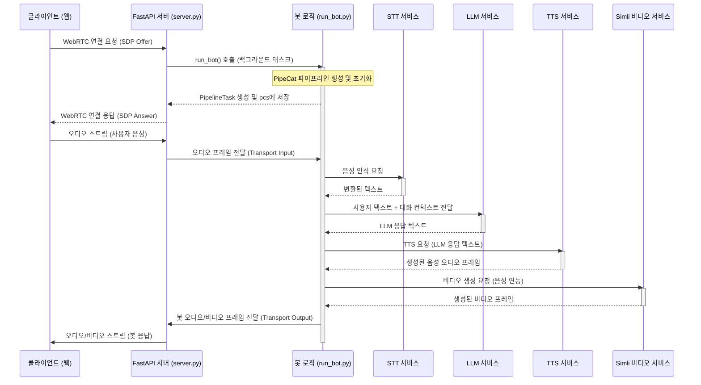
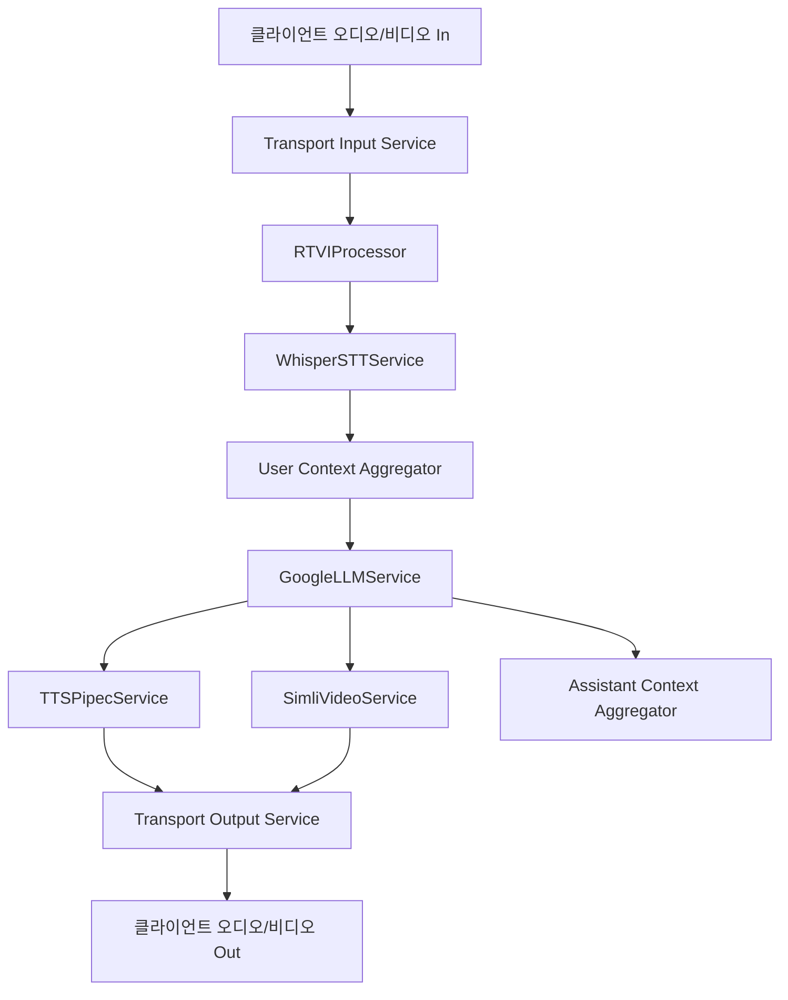
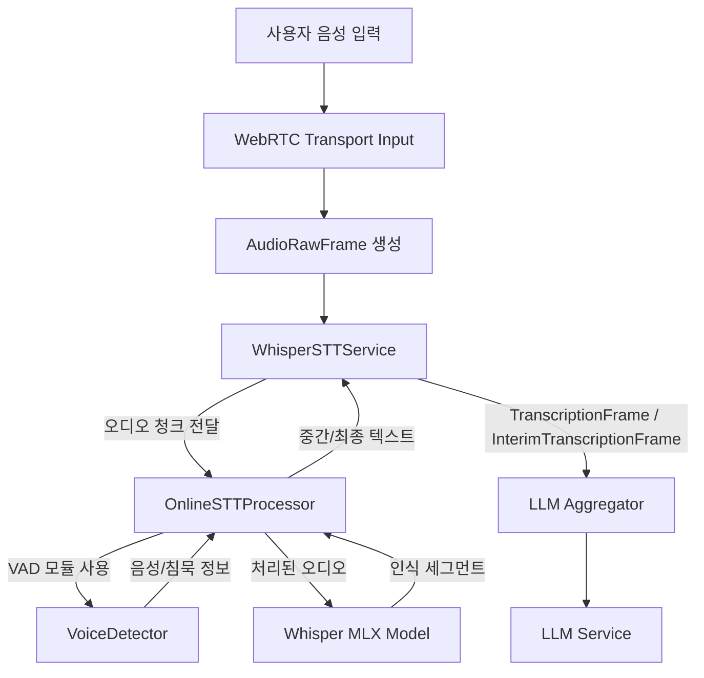
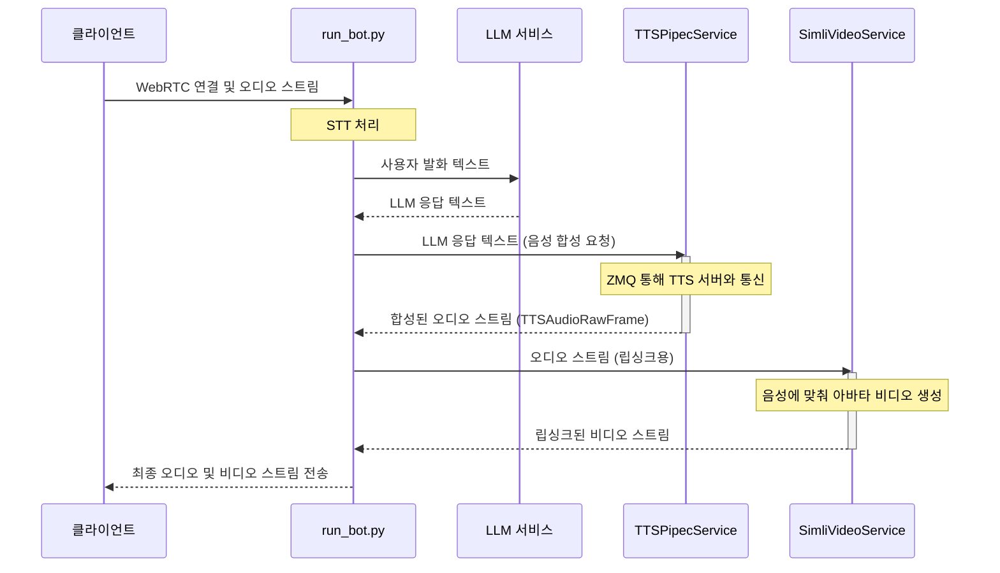
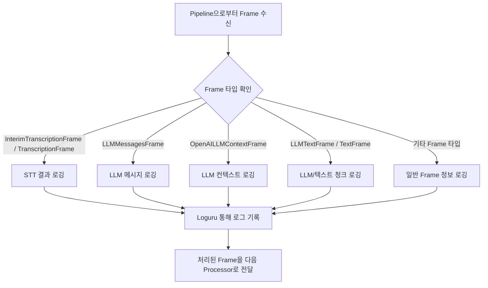

# Wiki Documentation for https://github.com/donggyun112/PipeChat_server

Generated on: 2025-05-11 13:33:51

## Table of Contents

- [프로젝트 개요 및 아키텍처](#page-1)
- [핵심 파이프라인 및 데이터 흐름](#page-2)
- [음성 인식 및 처리 (STT & VAD)](#page-3)
- [음성 합성 및 아바타 연동 (TTS & Simli)](#page-4)
- [WebRTC 통신 및 클라이언트 인터페이스](#page-5)
- [디버깅 및 로깅](#page-6)

<a id='page-1'></a>

## 프로젝트 개요 및 아키텍처

### Related Files

- `README.md`
- `server.py`
- `run_bot.py`

### Related Pages

Related topics: [핵심 파이프라인 및 데이터 흐름](#page-2), [WebRTC 통신 및 클라이언트 인터페이스](#page-5)

이 문서는 PipeChat_server 프로젝트의 전반적인 개요와 시스템 아키텍처를 설명합니다. 프로젝트의 목적, 주요 기능, 핵심 구성 요소들의 역할 및 상호작용 방식을 이해하는 데 도움을 줄 것입니다.

## 1. 프로젝트 목표 및 주요 기능

PipeChat_server는 실시간 음성 및 비디오 통신을 기반으로 하는 AI 챗봇 서버를 구축하는 것을 목표로 합니다. 주요 기능은 다음과 같습니다:

*   **실시간 양방향 통신**: WebRTC를 사용하여 클라이언트(웹 브라우저)와 서버 간에 오디오 및 비디오 스트림을 실시간으로 주고받습니다.
*   **음성 인식 (STT)**: 사용자의 음성을 텍스트로 변환합니다. (예: Whisper STT)
*   **대규모 언어 모델 (LLM) 연동**: 변환된 텍스트를 LLM(예: Google Gemini)에 전달하여 응답을 생성합니다.
*   **음성 합성 (TTS)**: LLM이 생성한 텍스트 응답을 자연스러운 음성으로 변환합니다.
*   **아바타 비디오 생성**: 생성된 음성에 맞춰 동기화된 아바타 비디오를 생성합니다. (예: Simli)
*   **파이프라인 기반 처리**: STT, LLM, TTS, 비디오 생성 등의 모듈을 PipeCat 프레임워크를 사용하여 파이프라인으로 구성하여 효율적으로 데이터를 처리합니다.

## 2. 핵심 구성 요소

프로젝트의 주요 로직은 다음 파일들에 의해 구현됩니다.

### 2.1. `server.py` - 웹 서버 및 WebRTC 관리

`server.py`는 FastAPI를 사용하여 웹 서버를 구축하고, 클라이언트와의 WebRTC 연결을 관리합니다.

*   **FastAPI 애플리케이션 설정**: HTTP 요청을 처리하고 WebRTC 시그널링을 위한 엔드포인트를 제공합니다.
*   **WebRTC 연결 관리**: 클라이언트로부터 SDP(Session Description Protocol) offer를 받아 WebRTC 연결을 수립하고, ICE(Interactive Connectivity Establishment) 후보를 교환합니다.
*   **봇 로직 연동**: 성공적인 WebRTC 연결 후, `run_bot.py`의 봇 실행 로직을 호출하여 실제 AI 챗봇 기능을 활성화합니다.
*   **정적 파일 제공**: 클라이언트 UI를 위한 HTML, CSS, JavaScript 파일을 제공합니다.

<p>Sources: <a href="https://github.com/donggyun112/PipeChat_server/blob/main/server.py" target="_blank" rel="noopener noreferrer" class="mb-1 mr-1 inline-flex items-stretch font-mono text-xs !no-underline">server.py</a></p>

```python
# server.py FastAPI 앱 생성 및 엔드포인트 예시
from fastapi import FastAPI, Request, BackgroundTasks
from fastapi.responses import RedirectResponse
from fastapi.staticfiles import StaticFiles
from pipecat.transports.network.small_webrtc import SmallWebRTCTransport, SmallWebRTCConnection
# ... (다른 import 문들) ...

# FastAPI 앱 생성
app = FastAPI(lifespan=lifespan)

# CORS 설정
app.add_middleware(
    CORSMiddleware,
    # ... (설정) ...
)

# 정적 파일 제공
app.mount("/static", StaticFiles(directory="static"), name="static")

# 활성 WebRTC 연결 저장소
pcs: Dict[str, Tuple[SmallWebRTCConnection, SmallWebRTCTransport, Optional[PipelineTask]]] = {}

@app.post("/offer")
async def offer_handler(request: Request, background_tasks: BackgroundTasks):
    body = await request.json()
    # ... (WebRTC offer 처리 로직) ...
    # transport = SmallWebRTCTransport(...)
    # connection = SmallWebRTCConnection(...)
    # pcs[connection.pc_id] = (connection, transport, None)
    # background_tasks.add_task(run_bot, connection, transport, pcs) # run_bot.py 호출
    # return {"sdp": connection.localDescription.sdp, "type": connection.localDescription.type}
```

### 2.2. `run_bot.py` - AI 챗봇 파이프라인 정의

`run_bot.py`는 PipeCat 프레임워크를 사용하여 AI 챗봇의 핵심 처리 파이프라인을 정의하고 실행합니다.

*   **서비스 초기화**: STT, LLM, TTS, Simli 비디오 서비스 등 필요한 AI 모듈들을 초기화합니다.
*   **PipeCat 파이프라인 구성**: 입력 오디오 처리부터 최종 오디오/비디오 출력까지의 과정을 정의합니다.
    *   `transport.input()`: WebRTC로부터 오디오/비디오 입력
    *   `RTVIProcessor`: 실시간 음성/영상 상호작용 처리
    *   `WhisperSTTService`: 음성-텍스트 변환
    *   `OpenAILLMContextAggregator` 및 `GoogleLLMService`: LLM을 통한 대화 처리
    *   `TTSPipecService`: 텍스트-음성 변환
    *   `SimliVideoService`: 음성 동기화 비디오 생성
    *   `transport.output()`: WebRTC로 오디오/비디오 출력
*   **이벤트 처리**: 클라이언트 연결, 연결 해제 등의 WebRTC 전송 계층 이벤트를 처리합니다.
*   **LLM 기능 확장**: `get_current_weather`와 같은 사용자 정의 함수를 LLM에 등록하여 외부 API와 연동합니다.

<p>Sources: <a href="https://github.com/donggyun112/PipeChat_server/blob/main/run_bot.py" target="_blank" rel="noopener noreferrer" class="mb-1 mr-1 inline-flex items-stretch font-mono text-xs !no-underline">run_bot.py</a></p>

```python
# run_bot.py 파이프라인 정의 예시
from pipecat.pipeline.pipeline import Pipeline
from pipecat.services.google.llm import GoogleLLMService
from stt.whisper_stt_service import WhisperSTTService
from tts.tts_service import TTSPipecService
from simli import SimliVideoService
# ... (다른 import 문들) ...

async def run_bot(connection: SmallWebRTCConnection, transport: SmallWebRTCTransport, pcs):
    # ... (서비스 초기화: llm, tts, simli, stt 등) ...

    pipeline = Pipeline([
        transport.input(),
        rtvi,  # RTVIProcessor
        stt,   # WhisperSTTService
        agg.user(), # OpenAILLMContextAggregator (user input)
        llm,   # GoogleLLMService
        tts,   # TTSPipecService
        simli, # SimliVideoService
        transport.output(),
        agg.assistant() # OpenAILLMContextAggregator (assistant response)
    ])

    pipeline_task = PipelineTask(pipeline, params=PipelineParams(...))
    # ... (pipeline_task 관리 및 실행) ...
```

### 2.3. `README.md` - 프로젝트 소개 및 설정

`README.md` 파일은 프로젝트의 최상위 레벨에 위치하며, 다음과 같은 정보를 포함하는 것이 일반적입니다:

*   프로젝트의 목적 및 기능에 대한 간략한 설명
*   프로젝트 실행을 위한 사전 요구사항 (예: Python 버전, 필요한 라이브러리)
*   설치 및 실행 방법
*   환경 변수 설정 가이드 (예: API 키)
*   프로젝트 구조에 대한 간략한 안내

<p>Sources: <a href="https://github.com/donggyun112/PipeChat_server/blob/main/README.md" target="_blank" rel="noopener noreferrer" class="mb-1 mr-1 inline-flex items-stretch font-mono text-xs !no-underline">README.md</a></p>

## 3. 아키텍처 다이어그램

다음은 클라이언트와 서버 간의 상호작용 및 서버 내부의 데이터 처리 흐름을 보여주는 시퀀스 다이어그램입니다.



## 4. 구성 요소 통합 방식

1.  **클라이언트 연결**: 사용자가 웹 클라이언트 (`static/index.html`)를 통해 "연결 시작" 버튼을 누르면, 클라이언트는 SDP offer를 생성하여 `server.py`의 `/offer` 엔드포인트로 전송합니다.
2.  **WebRTC 핸드셰이크**: `server.py`는 이 offer를 받아 WebRTC 연결 설정을 시작하고, 자체 SDP answer를 생성하여 클라이언트에게 응답합니다. 이 과정에서 `SmallWebRTCTransport`와 `SmallWebRTCConnection` 객체가 생성됩니다.
3.  **봇 로직 실행**: WebRTC 연결 설정 과정에서 `server.py`는 `background_tasks.add_task(run_bot, connection, transport, pcs)`를 통해 `run_bot.py`의 `run_bot` 함수를 비동기적으로 호출합니다. 이때, 생성된 `connection`과 `transport` 객체, 그리고 활성 연결을 관리하는 `pcs` 딕셔너리가 인자로 전달됩니다.
4.  **파이프라인 가동**: `run_bot` 함수 내에서는 STT, LLM, TTS, Simli 비디오 서비스를 포함하는 PipeCat 파이프라인을 구성하고 `PipelineTask`로 만들어 실행합니다. 이 파이프라인은 `transport.input()`을 통해 클라이언트로부터 오디오/비디오 데이터를 수신하고, 처리 결과를 `transport.output()`을 통해 클라이언트로 전송합니다.
5.  **데이터 흐름**:
    *   클라이언트의 음성은 WebRTC를 통해 `transport.input()`으로 들어와 STT 서비스에서 텍스트로 변환됩니다.
    *   변환된 텍스트는 LLM 서비스로 전달되어 응답 텍스트를 생성합니다.
    *   LLM 응답은 TTS 서비스를 통해 음성 오디오로, Simli 서비스를 통해 아바타 비디오로 변환됩니다.
    *   최종 생성된 오디오와 비디오는 `transport.output()`을 통해 WebRTC 연결을 거쳐 클라이언트로 스트리밍되어 사용자에게 보여집니다.
6.  **상태 관리**: `pcs` 딕셔너리는 `server.py`와 `run_bot.py` 간에 공유되어, 특정 WebRTC 연결(`pc_id` 기준)에 해당하는 `PipelineTask`를 관리하고, 연결 종료 시 관련 리소스를 정리하는 데 사용됩니다.

이러한 방식으로 `server.py`는 네트워크 연결 및 시그널링을 담당하고, `run_bot.py`는 실제 AI 기반의 상호작용 로직을 PipeCat 파이프라인을 통해 처리하여, 실시간 음성/영상 챗봇 기능을 구현합니다.

---

<a id='page-2'></a>

## 핵심 파이프라인 및 데이터 흐름

### Related Files

- `run_bot.py`

### Related Pages

Related topics: [프로젝트 개요 및 아키텍처](#page-1), [음성 인식 및 처리 (STT & VAD)](#page-3), [음성 합성 및 아바타 연동 (TTS & Simli)](#page-4)

## 핵심 파이프라인 및 데이터 흐름: `run_bot.py`

### 개요
`run_bot.py` 파일은 PipeChat 서버의 핵심 로직 중 하나로, 새로운 클라이언트 WebRTC 연결이 수립될 때마다 호출되어 해당 연결에 대한 실시간 음성/영상 챗봇 파이프라인을 설정하고 실행하는 역할을 합니다. 이 파이프라인은 사용자의 음성 입력을 받아 텍스트로 변환(STT), 대규모 언어 모델(LLM)을 통해 응답 생성, 생성된 텍스트를 음성으로 변환(TTS)하고, 아바타 영상을 생성(Simli)하여 다시 클라이언트에게 전송하는 일련의 과정을 처리합니다.

### 주요 기능 및 목적
*   **실시간 양방향 통신 파이프라인 구축**: WebRTC를 통해 클라이언트와 서버 간의 실시간 오디오 및 비디오 스트리밍을 처리하는 파이프라인을 동적으로 생성하고 관리합니다.
*   **AI 서비스 통합**: 다음과 같은 다양한 AI 기반 서비스를 통합하여 지능적인 대화형 에이전트를 구현합니다.
    *   **STT (Speech-to-Text)**: 사용자 음성을 텍스트로 변환 (WhisperSTTService 사용).
    *   **LLM (Large Language Model)**: 변환된 텍스트를 기반으로 사용자 의도를 파악하고 적절한 응답 생성 (GoogleLLMService 사용).
    *   **TTS (Text-to-Speech)**: LLM이 생성한 텍스트 응답을 자연스러운 음성으로 변환 (TTSPipecService 사용).
    *   **Simli (Avatar Video Service)**: TTS 음성에 맞춰 아바타의 입 모양과 표정을 동기화하여 영상 생성 (SimliVideoService 사용).
*   **컨텍스트 관리 및 기능 확장**: `OpenAILLMContext`를 사용하여 대화의 맥락을 유지하고, `ToolsSchema`를 통해 날씨 조회와 같은 외부 기능을 LLM과 연동합니다.
*   **이벤트 기반 처리**: 클라이언트 연결, 연결 해제, 메시지 수신 등 다양한 이벤트를 비동기적으로 처리하여 효율적인 자원 사용과 응답성을 보장합니다.
*   **인터럽트 및 동시성 관리**: 사용자의 발화 시작 시 기존 봇의 응답을 중단시키는 인터럽트 기능을 지원하며, `asyncio`를 통해 다수의 클라이언트 연결을 동시에 처리합니다.

### 파이프라인 구성 요소
`run_bot` 함수 내에서 정의되는 파이프라인은 다음과 같은 주요 구성 요소(서비스 및 프로세서)들로 이루어집니다:

1.  `transport.input()`: WebRTC로부터 들어오는 클라이언트의 오디오/비디오 프레임을 파이프라인으로 전달합니다.
2.  `rtvi (RTVIProcessor)`: 실시간 음성 인텔리전스(Real-Time Voice Intelligence) 처리를 담당하며, VAD(Voice Activity Detection), 사용자 발화 시작/종료 이벤트 등을 관리합니다.
3.  `stt (WhisperSTTService)`: 입력된 오디오를 텍스트로 변환합니다.
4.  `agg.user() (OpenAILLMContextAggregator)`: STT 결과를 사용자 메시지로 LLM 컨텍스트에 추가합니다.
5.  `llm (GoogleLLMService)`: 현재 대화 컨텍스트와 사용자 입력을 바탕으로 응답 텍스트를 생성합니다. 필요시 등록된 도구(예: 날씨 조회)를 호출합니다.
6.  `tts (TTSPipecService)`: LLM이 생성한 텍스트를 음성 오디오로 변환합니다.
7.  `simli (SimliVideoService)`: TTS 음성에 맞춰 아바타 영상을 생성합니다.
8.  `transport.output()`: 생성된 TTS 오디오와 Simli 아바타 영상을 WebRTC를 통해 클라이언트로 전송합니다.
9.  `agg.assistant() (OpenAILLMContextAggregator)`: LLM의 응답을 어시스턴트 메시지로 LLM 컨텍스트에 추가합니다.

### 데이터 흐름도

다음은 `run_bot.py`에서 구성되는 파이프라인의 주요 데이터 흐름을 나타낸 다이어그램입니다.



**흐름 설명:**

1.  클라이언트로부터 오디오 및 비디오 데이터가 WebRTC를 통해 `TransportInput`으로 들어옵니다.
2.  `RTVIProcessor`는 VAD 등을 처리하고 오디오 프레임을 후속 서비스로 전달합니다.
3.  `WhisperSTTService`는 오디오를 텍스트로 변환합니다.
4.  변환된 텍스트는 `UserAggregator`를 통해 LLM 컨텍스트에 사용자 메시지로 추가됩니다.
5.  `GoogleLLMService`는 컨텍스트를 기반으로 응답 텍스트를 생성합니다.
6.  생성된 응답 텍스트는 `TTSPipecService`로 전달되어 음성 오디오로 변환되고, 동시에 `SimliVideoService`로 전달되어 아바타 영상 생성에 사용됩니다.
7.  변환된 음성 오디오와 생성된 아바타 영상은 `TransportOutput`을 통해 클라이언트로 전송됩니다.
8.  LLM의 응답은 `AssistantAggregator`를 통해 LLM 컨텍스트에 어시스턴트 메시지로 추가되어 다음 턴의 대화에 활용됩니다.

### 주요 코드 스니펫

#### 1. 파이프라인 정의
`run_bot.py`에서 파이프라인 객체를 생성하고 각 서비스를 연결하는 부분입니다.

```python
# run_bot.py L45-L56
		pipeline = Pipeline([
			transport.input(),
			rtvi,
			stt,
			agg.user(),
			llm,
			tts,
			simli,
			transport.output(),
			agg.assistant()
		])
```

#### 2. LLM 및 시스템 프롬프트 설정
Google Gemini 모델을 사용하며, 한국어 응답 및 특정 역할(영어 표현 코치 AI)을 수행하도록 시스템 프롬프트를 설정합니다.

```python
# run_bot.py L126-L132
		llm = GoogleLLMService(
			api_key=os.getenv("GOOGLE_API_KEY"),
			model=llm_model, # "gemini-2.0-flash"
			params=GoogleLLMService.InputParams(temperature=1, language=Language.KO_KR, thinking_budget=0),
			system_prompt=llm_system_prompt # "You are a fast, low-latency chatbot..." (기본 프롬프트)
		)
# run_bot.py L168-L186 (실제 적용되는 시스템 프롬프트)
		system_prompt = """특수문자를 사용하면 안됩니다.[절대사용하지말아야할 문자 : *, / ]저는 한국인을 위한 영어 표현 코치 AI 에이전트입니다. 한국어 질문에 영어 표현과 간단한 한국어 설명을 제공합니다. 사용자의 한국어 입력을 이해하고 적절한 영어 표현을 자연스러운 발음으로 들려줍니다.
날씨, 영어 표현, 간단한 회화 등 일상 질문에 답변하며, 특히 비즈니스, 여행, 일상 영어 표현에 특화되어 있습니다. STT로 인한 오타나 인식 오류가 있더라도 문맥을 고려해 의도를 파악합니다.
한국어 또는 영어로만 답변하며, 깔끔하고 자연스러운 문장으로 TTS에 최적화된 응답을 제공합니다 구체적인 씬 예시에 맞는 질문을 받는다면 구체적인 씬 예시의 답변을 제공합니다.
시나리오 정보:
- 비즈니스 영어: 회의, 이메일, 프레젠테이션 표현
- 여행 영어: 호텔, 레스토랑, 교통, 쇼핑 관련 표현
- 일상 영어: 인사, 소개, 취미, 날씨 대화

구체적인 씬 예시:
처음 인사말 :
"안녕하세요! 영어 표현 코치 AI입니다. 어떤 영어 표현이 필요하신가요?"
[비즈니스 영어 씬]
사용자: 외국 동료에게 프로젝트 지연을 알리는 이메일을 어떻게 쓰면 좋을까요?
AI 코치: 프로젝트 지연 안내 이메일은 다음과 같이 작성할 수 있습니다:
"I regret to inform you that there will be a delay in our project timeline due to technical issues. The new expected 
```

#### 3. 도구(Function Calling) 정의 및 등록
날씨 정보를 조회할 수 있는 `get_current_weather` 함수를 정의하고 LLM에 등록하여, 사용자가 날씨를 물어보면 이 함수를 호출하여 실제 날씨 정보를 응답에 포함시킬 수 있도록 합니다.

```python
# run_bot.py L150-L166
		weather_function = FunctionSchema(
			name="get_current_weather",
			description="Get the current weather for a specific location",
			# ... (속성 정의) ...
		)
		async def fetch_weather(function_name, tool_call_id, args, llm, context, result_callback):
			location = args.get("location", "서울")
			format = args.get("format", "celsius")
			
			weather_data = get_weather(location, format) # utils.get_weather 호출
			
			await result_callback(weather_data)

		# ...
		tools = ToolsSchema(standard_tools=[weather_function])
		# ...
		llm.register_function("get_current_weather", fetch_weather)
```

#### 4. 클라이언트 이벤트 핸들러
WebRTC Transport를 통해 클라이언트의 연결, 연결 해제 등의 이벤트를 처리합니다.

```python
# run_bot.py L66-L72
		@transport.event_handler("on_client_connected")
		async def on_client_connected(tr, client):
			logger.info(f"[run_bot:{pc_id}] 🔗 Transport: 클라이언트 연결됨")
			await pipeline_task.queue_frames([agg.user().get_context_frame()])
			await asyncio.sleep(2)
			logger.info(f"[run_bot:{pc_id}] 🤖 BotReady 메시지 전송 시도")
			await rtvi.set_bot_ready()
			logger.info(f"[run_bot:{pc_id}] ✅ BotReady 메시지 전송 완료")
```

### 전체 아키텍처와의 통합
`run_bot.py`의 `run_bot` 함수는 `server.py`에서 새로운 WebRTC 연결이 성공적으로 수립될 때 호출됩니다. `server.py`는 FastAPI를 사용하여 웹 서버를 구성하고, `/offer` 엔드포인트 등을 통해 WebRTC 핸드셰이크 과정을 처리합니다. 연결이 완료되면 `SmallWebRTCConnection` 객체와 `SmallWebRTCTransport` 객체가 생성되고, 이 객체들과 함께 `run_bot` 함수가 백그라운드 태스크로 실행됩니다.

`server.py`의 `pcs` (pipeline connections) 딕셔너리는 현재 활성화된 `PipelineTask`들을 관리하며, `pc_id` (peer connection ID)를 키로 사용합니다. `run_bot` 함수는 이 `pcs` 딕셔너리에 생성된 `PipelineTask`를 저장하거나 업데이트하여, 서버 전체적으로 파이프라인의 상태를 추적하고 관리할 수 있도록 합니다. 클라이언트 연결이 종료되면 해당 `PipelineTask`는 취소되고 `pcs`에서 제거됩니다.

이러한 구조를 통해 각 클라이언트 연결마다 독립적인 대화 파이프라인을 생성하고 운영할 수 있으며, 서버는 여러 클라이언트의 요청을 동시에 처리할 수 있습니다.

<p>Sources: <a href="https://github.com/donggyun112/PipeChat_server/blob/main/run_bot.py" target="_blank" rel="noopener noreferrer" class="mb-1 mr-1 inline-flex items-stretch font-mono text-xs !no-underline">run_bot.py</a></p>

---

<a id='page-3'></a>

## 음성 인식 및 처리 (STT & VAD)

### Related Files

- `stt/whisper_stt_service.py`
- `stt/light_whisper_streaming.py`
- `vad/voice_check.py`
- `vad/vad_test.py`

### Related Pages

Related topics: [핵심 파이프라인 및 데이터 흐름](#page-2)

## 음성 인식 및 처리 (STT & VAD)

### 1. 개요

음성 인식(Speech-to-Text, STT)은 사람의 음성을 텍스트 데이터로 변환하는 기술이며, 음성 활동 감지(Voice Activity Detection, VAD)는 오디오 스트림에서 사람의 음성이 존재하는 구간을 식별하는 기술입니다. PipeChat\_server에서 이 두 기술은 사용자의 음성 입력을 실시간으로 처리하고, 이를 기반으로 챗봇과 상호작용하는 핵심적인 역할을 수행합니다. VAD를 통해 음성 구간만을 효율적으로 STT 모듈로 전달하여 처리 성능을 높이고, 불필요한 오디오 처리를 줄입니다.

### 2. 핵심 구성 요소

#### 2.1. 음성 활동 감지 (VAD)

VAD는 오디오 입력에서 실제 음성 부분만을 감지하여 STT 처리를 위한 오디오 세그먼트를 생성합니다.

##### `vad/voice_check.py`

이 파일은 `VoiceDetector` 클래스와 `AudioEventManager` 클래스를 정의하여 음성 활동 감지 및 관련 이벤트 관리를 담당합니다.

*   **`VoiceDetector` 클래스**
    *   **목적**: 오디오 청크를 분석하여 음성 존재 여부를 판단합니다. 에너지 레벨과 Silero VAD 모델을 함께 사용하여 정확도를 높입니다.
    *   **주요 기능**:
        *   Silero VAD ONNX 모델(`silero_vad_16k_op15.onnx`) 로드 및 사용
        *   오디오 에너지 계산 및 임계값 기반 감지
        *   음성 시작, 지속, 종료 시점 판단
        *   디바운싱(Debouncing) 로직을 통해 짧은 노이즈나 침묵으로 인한 오탐 방지
        *   `AudioEventManager`를 통한 이벤트 발행 (선택 사항)
    *   **코드 예시**: `process_audio_chunk` 메서드 (핵심 로직)
        ```python
        # vad/voice_check.py 일부
        def process_audio_chunk(self, chunk: np.ndarray) -> bool:
            # ... (에너지 계산 및 버퍼 관리) ...

            # Silero VAD 모델을 사용하여 음성 확률 계산
            speech_prob = self.model(audio_float32, self.sample_rate).item()
            self.recent_vad_probs.append(speech_prob)

            is_currently_speaking = speech_prob >= self.vad_threshold
            # ... (상태 변화 감지 및 디바운싱 로직) ...

            if self.use_event_manager and self.event_manager:
                self.event_manager.publish(AudioEventType.VAD_STATE_CHANGE, 
                                           {"speaking": self.is_speaking_now, "probability": speech_prob})
            return self.is_speaking_now
        ```

*   **`AudioEventManager` 클래스**
    *   **목적**: 오디오 관련 이벤트(예: 발화 시작, 발화 종료, VAD 상태 변경)를 시스템의 다른 부분에 알리는 발행-구독(publish-subscribe) 패턴을 제공하는 싱글톤 클래스입니다.
    *   **주요 기능**:
        *   이벤트 구독(`subscribe`), 구독 해제(`unsubscribe`), 발행(`publish`)
        *   공유 상태(`_shared_state`) 관리를 통해 현재 오디오 상태(발화 중 여부, 에너지 레벨 등) 제공
    *   **코드 예시**: 이벤트 발행
        ```python
        # vad/voice_check.py 일부
        class AudioEventManager:
            # ...
            def publish(self, event_type: AudioEventType, data=None):
                # ...
                for callback in self._subscribers[event_type]:
                    try:
                        callback(data)
                    except Exception as e:
                        logging.error(f"이벤트 처리 중 오류: {e}")
                return True
        ```

<p>Sources: <a href="https://github.com/donggyun112/PipeChat_server/blob/main/vad/voice_check.py" target="_blank" rel="noopener noreferrer" class="mb-1 mr-1 inline-flex items-stretch font-mono text-xs !no-underline">vad/voice_check.py</a></p>

##### `vad/vad_test.py` (VAD 활용 예시)

이 파일은 `VoiceDetector`를 사용하여 실제 오디오 스트림에서 음성을 감지하고 녹음하는 `AudioRecorder` 클래스를 포함하는 테스트 스크립트입니다.

*   **`AudioRecorder` 클래스**:
    *   `VoiceDetector`를 활용하여 마이크 입력으로부터 음성 구간을 감지합니다.
    *   음성 감지 시 녹음을 시작하고, 일정 시간 침묵이 감지되면 녹음을 종료합니다.
    *   Pre-buffering 및 Post-buffering 기능을 통해 발화 시작 전후의 오디오도 일부 포함하여 자연스러운 녹음이 가능하도록 합니다.
    *   녹음된 오디오는 임시 WAV 파일로 저장되고, `start_action_after_speech` 메서드를 통해 후속 처리(예: STT)를 트리거할 수 있습니다.

<p>Sources: <a href="https://github.com/donggyun112/PipeChat_server/blob/main/vad/vad_test.py" target="_blank" rel="noopener noreferrer" class="mb-1 mr-1 inline-flex items-stretch font-mono text-xs !no-underline">vad/vad_test.py</a></p>

#### 2.2. 음성 인식 (STT)

STT는 VAD를 통해 전달받은 음성 오디오 세그먼트를 텍스트로 변환합니다.

##### `stt/light_whisper_streaming.py`

이 파일은 `OnlineSTTProcessor` 클래스를 정의하여 Whisper 모델을 사용한 스트리밍 음성 인식을 구현합니다.

*   **`OnlineSTTProcessor` 클래스**
    *   **목적**: 실시간으로 들어오는 오디오 청크를 처리하여 중간 및 최종 인식 결과를 제공합니다.
    *   **주요 기능**:
        *   `lightning_whisper_mlx` 모델 사용.
        *   내부 오디오 버퍼(`utterance_buffer`)를 관리하며, VAD(`VoiceDetector`)를 통해 발화 시작 및 종료를 감지합니다.
        *   `insert_audio_chunk()`: 새로운 오디오 데이터를 버퍼에 추가합니다.
        *   `process_iter()`: 버퍼의 오디오를 처리하여 중간(interim) 인식 결과를 생성합니다.
        *   `finish_utterance()`: 발화가 종료되면 최종(final) 인식 결과를 생성합니다.
        *   `HypothesisBuffer`를 사용하여 인식 결과의 안정성을 높입니다.
        *   `KoreanTokenizer`를 사용하여 한국어 텍스트를 문장 단위로 분리할 수 있습니다.
    *   **코드 예시**: 오디오 청크 삽입 및 처리
        ```python
        # stt/light_whisper_streaming.py 일부
        class OnlineSTTProcessor:
            # ...
            def insert_audio_chunk(self, audio_chunk: np.ndarray, current_time: float):
                # ... (VAD를 이용한 발화 감지 및 버퍼 관리) ...
                if self.utterance_in_progress:
                    self.utterance_buffer = np.concatenate([self.utterance_buffer, audio_chunk])
                
                # 발화 종료 감지 시 finish_utterance 호출
                if not self.voice_active and self.utterance_in_progress and \
                   (current_time - self.last_voice_activity > self.voice_timeout):
                    return self.finish_utterance()
                return None # 중간 결과 또는 아무것도 없음

            def process_iter(self):
                # ... (버퍼의 오디오로 중간 인식 수행) ...
                # interim_text = self.whisper.transcribe(...)
                return start_time, end_time, interim_text, metadata
        ```

*   **`KoreanTokenizer` 클래스**: 한국어 텍스트를 문장 단위로 분리합니다. `kss` 라이브러리가 설치되어 있으면 이를 사용하고, 없으면 정규식을 이용한 기본 분리 기능을 제공합니다.
*   **`HypothesisBuffer` 클래스**: STT 모델이 연속적으로 생성하는 가설들 사이에서 안정적인 텍스트 부분을 확정하여 사용자에게 더 일관된 중간 결과를 보여주는 데 도움을 줍니다.

<p>Sources: <a href="https://github.com/donggyun112/PipeChat_server/blob/main/stt/light_whisper_streaming.py" target="_blank" rel="noopener noreferrer" class="mb-1 mr-1 inline-flex items-stretch font-mono text-xs !no-underline">stt/light_whisper_streaming.py</a></p>

##### `stt/whisper_stt_service.py`

`pipecat` 프레임워크의 `STTService`를 상속받아 Whisper 모델을 사용하는 STT 서비스를 구현합니다.

*   **`WhisperSTTService` 클래스**
    *   **목적**: `pipecat` 파이프라인 내에서 오디오 프레임을 입력받아 텍스트 프레임으로 변환하는 서비스 역할을 합니다.
    *   **주요 기능**:
        *   `lightning_whisper_mlx` 모델과 `OnlineSTTProcessor`를 내부적으로 사용하여 STT 수행.
        *   입력으로 `AudioRawFrame`을 받아 처리하고, `TranscriptionFrame` (최종 결과) 및 `InterimTranscriptionFrame` (중간 결과)을 생성하여 파이프라인의 다음 단계로 전달.
        *   오디오 버퍼링 및 샘플레이트 관리.
        *   모델 이름, 버퍼 크기 등 설정을 초기화 시 지정 가능.
    *   **코드 예시**: `run_stt` 메서드
        ```python
        # stt/whisper_stt_service.py 일부
        class WhisperSTTService(STTService):
            # ...
            async def run_stt(self, audio: bytes) -> AsyncGenerator[Frame, None]:
                pcm_f32 = (np.frombuffer(audio, np.int16)
                           .astype(np.float32, copy=False) / 32768.0)
                
                current_time = time.time()
                
                final_res = self.stt_processor.insert_audio_chunk(pcm_f32, current_time)
                if isinstance(final_res, dict):
                    text = final_res["text"]
                    if text:
                        yield TranscriptionFrame(text=text, language="ko-KR", ...)
                    return
                
                start, end, interim_text, meta = self.stt_processor.process_iter()
                if interim_text:
                    yield InterimTranscriptionFrame(text=interim_text, language="ko-KR", ...)
        ```

<p>Sources: <a href="https://github.com/donggyun112/PipeChat_server/blob/main/stt/whisper_stt_service.py" target="_blank" rel="noopener noreferrer" class="mb-1 mr-1 inline-flex items-stretch font-mono text-xs !no-underline">stt/whisper_stt_service.py</a></p>

### 3. 데이터 흐름 및 상호작용

다음은 원시 오디오 입력부터 최종 텍스트 변환까지의 대략적인 데이터 흐름을 나타낸 다이어그램입니다.



**다이어그램 설명:**

1.  **사용자 음성 입력**: 사용자가 마이크를 통해 음성을 입력합니다.
2.  **WebRTC Transport Input**: WebRTC를 통해 서버로 오디오 데이터가 스트리밍됩니다.
3.  **AudioRawFrame 생성**: 입력된 오디오는 `AudioRawFrame` 형태로 변환됩니다.
4.  **WhisperSTTService**: 이 서비스가 `AudioRawFrame`을 수신합니다.
5.  **OnlineSTTProcessor**: `WhisperSTTService`는 내부의 `OnlineSTTProcessor`에게 오디오 청크를 전달합니다.
6.  **VoiceDetector**: `OnlineSTTProcessor`는 `VoiceDetector`를 사용하여 현재 오디오 청크가 음성인지 침묵인지 판단합니다.
7.  **Whisper MLX Model**: VAD를 통해 유효한 음성으로 판단된 오디오 데이터가 Whisper 모델로 전달되어 실제 텍스트 변환이 이루어집니다.
8.  **인식 세그먼트**: 모델은 인식된 텍스트 세그먼트를 반환합니다.
9.  **중간/최종 텍스트**: `OnlineSTTProcessor`는 이를 바탕으로 중간 또는 최종 인식 텍스트를 생성합니다.
10. **TranscriptionFrame / InterimTranscriptionFrame**: `WhisperSTTService`는 이 텍스트를 담아 해당 프레임 타입으로 변환하여 파이프라인의 다음 단계(주로 LLM Aggregator)로 전달합니다.
11. **LLM Service**: 최종적으로 변환된 텍스트는 LLM 서비스로 전달되어 응답 생성에 사용됩니다.

### 4. 전체 아키텍처와의 통합

*   **`run_bot.py`의 파이프라인**: `WhisperSTTService`는 `run_bot.py`에 정의된 `pipecat` 파이프라인의 한 구성요소로 포함됩니다. 이 파이프라인은 `transport.input()` (예: WebRTC를 통한 오디오 입력) -> `stt` (`WhisperSTTService`) -> `agg.user()` (LLM 컨텍스트 집계기) -> `llm` (LLM 서비스) 등의 순서로 구성됩니다.
    ```python
    # run_bot.py 일부
    pipeline = Pipeline([
        transport.input(), # WebRTC 등으로부터 오디오 수신
        rtvi,              # RTVI 처리기 (선택적)
        stt,               # WhisperSTTService 인스턴스
        agg.user(),        # 사용자 발화 집계
        llm,               # LLM 서비스
        tts,               # TTS 서비스
        simli,             # Simli 비디오 서비스 (선택적)
        transport.output(),# WebRTC 등으로 오디오/비디오 송신
        agg.assistant()    # 봇 응답 집계
    ])
    ```
*   **VAD의 역할**:
    *   `OnlineSTTProcessor` 내에서 `VoiceDetector` (VAD)가 사용되어, 실제 사용자가 말하고 있는 구간을 효과적으로 감지합니다.
    *   이를 통해 불필요한 침묵 구간에 대한 STT 연산을 줄여 리소스 사용을 최적화하고, 응답 지연 시간을 단축하는 데 기여합니다.
    *   사용자의 발화 시작과 끝을 명확히 구분하여, 보다 정확한 단위로 LLM에 사용자 입력을 전달할 수 있게 합니다. 이는 대화의 자연스러움과 정확성을 높이는 데 중요합니다.
*   **실시간 상호작용**: STT 서비스에서 생성되는 `InterimTranscriptionFrame` (중간 인식 결과)은 사용자에게 실시간 피드백을 제공하여 마치 사람이 듣고 이해하는 듯한 경험을 줄 수 있으며, `TranscriptionFrame` (최종 인식 결과)은 LLM이 사용자의 의도를 파악하고 응답을 생성하는 데 사용됩니다.

### 5. 소스 파일

*   <p>VAD 핵심 로직: <a href="https://github.com/donggyun112/PipeChat_server/blob/main/vad/voice_check.py" target="_blank" rel="noopener noreferrer" class="mb-1 mr-1 inline-flex items-stretch font-mono text-xs !no-underline">vad/voice_check.py</a></p>
*   <p>VAD 테스트 및 활용 예시: <a href="https://github.com/donggyun112/PipeChat_server/blob/main/vad/vad_test.py" target="_blank" rel="noopener noreferrer" class="mb-1 mr-1 inline-flex items-stretch font-mono text-xs !no-underline">vad/vad_test.py</a></p>
*   <p>스트리밍 STT 처리 로직: <a href="https://github.com/donggyun112/PipeChat_server/blob/main/stt/light_whisper_streaming.py" target="_blank" rel="noopener noreferrer" class="mb-1 mr-1 inline-flex items-stretch font-mono text-xs !no-underline">stt/light_whisper_streaming.py</a></p>
*   <p>Pipecat STT 서비스 구현: <a href="https://github.com/donggyun112/PipeChat_server/blob/main/stt/whisper_stt_service.py" target="_blank" rel="noopener noreferrer" class="mb-1 mr-1 inline-flex items-stretch font-mono text-xs !no-underline">stt/whisper_stt_service.py</a></p>
*   <p>메인 파이프라인 구성: <a href="https://github.com/donggyun112/PipeChat_server/blob/main/run_bot.py" target="_blank" rel="noopener noreferrer" class="mb-1 mr-1 inline-flex items-stretch font-mono text-xs !no-underline">run_bot.py</a></p>
Error: Invalid operation: The `response.text` quick accessor requires the response to contain a valid `Part`, but none were returned. The candidate's [finish_reason](https://ai.google.dev/api/generate-content#finishreason) is 1.

---

<a id='page-4'></a>

## 음성 합성 및 아바타 연동 (TTS & Simli)

### Related Files

- `tts/tts_service.py`
- `run_bot.py`

### Related Pages

Related topics: [핵심 파이프라인 및 데이터 흐름](#page-2)

## 음성 합성(TTS) 및 아바타 연동(Simli)

### 개요
PipeChat_server에서 "음성 합성(TTS) 및 아바타 연동(Simli)"은 사용자와의 상호작용을 더 자연스럽고 몰입감 있게 만들기 위한 핵심 기능입니다. 텍스트 기반의 AI 응답을 사람과 유사한 음성으로 변환하고, 이 음성에 맞춰 아바타의 입 모양을 동기화하여 시청각적인 피드백을 제공합니다.

### 목적 및 기능
*   **TTS (Text-to-Speech)**: 대규모 언어 모델(LLM)이 생성한 텍스트 응답을 자연스러운 음성으로 변환합니다. 이를 통해 사용자는 AI의 답변을 귀로 들을 수 있습니다.
*   **Simli (아바타 연동)**: 생성된 음성에 맞춰 실시간으로 아바타의 입 모양(립싱크)과 표정을 동기화합니다. 이는 사용자에게 마치 실제 사람과 대화하는 듯한 경험을 제공하여 상호작용의 질을 높입니다.

`run_bot.py` 파일은 전체 파이프라인을 구성하고 각 서비스를 초기화하며, `tts/tts_service.py`는 실제 TTS 변환 로직을 담당하는 서비스입니다.

### 주요 구성 요소 및 동작 방식

#### 1. `run_bot.py`에서의 TTS 및 Simli 설정
`run_bot.py`는 파이프라인 내에서 TTS 서비스와 Simli 비디오 서비스를 설정하고 연동합니다.

*   **TTS 서비스 초기화**: `TTSPipecService`를 사용하여 지정된 음성(예: "KR")과 속도로 TTS 기능을 설정합니다.
    ```python
    # File: run_bot.py
    # Lines: 48-52
    tts = TTSPipecService(
    	voice="KR",
    	speed=tts_speed,
    	Language=Language.KO,
    )
    ```
*   **Simli 비디오 서비스 초기화**: `SimliVideoService`를 사용하여 API 키, Face ID 등의 설정을 통해 아바타 서비스를 초기화합니다. `syncAudio=True` 옵션은 오디오와 비디오의 동기화를 활성화합니다.
    ```python
    # File: run_bot.py
    # Lines: 39-47
    simli = SimliVideoService(
    	SimliConfig(
    		apiKey=os.getenv("SIMLI_API_KEY"),
    		faceId=os.getenv("SIMLI_FACE_ID"),
    		syncAudio=True,
    		handleSilence=True,
    		maxSessionLength=3000,
    		maxIdleTime=30
    	),
    	latency_interval=0
    )
    ```
*   **파이프라인 구성**: STT(Speech-to-Text) → LLM → TTS → Simli 순서로 데이터가 처리되도록 파이프라인을 구성합니다. LLM이 생성한 텍스트가 TTS로 전달되어 음성으로 변환되고, 이 음성이 다시 Simli로 전달되어 아바타의 립싱크에 사용됩니다.
    ```python
    # File: run_bot.py
    # Lines: 122-131
    pipeline = Pipeline([
    	transport.input(),
    	rtvi,
    	stt,
    	agg.user(),
    	llm,
    	tts, # LLM의 출력이 TTS로 전달
    	simli, # TTS의 출력이 Simli로 전달
    	transport.output(),
    	agg.assistant()
    ])
    ```

#### 2. `tts/tts_service.py`의 TTSPipecService
`TTSPipecService`는 외부 TTS 서버와 ZMQ(ZeroMQ)를 통해 통신하여 텍스트를 음성으로 변환하는 역할을 수행합니다.

*   **초기화 (`__init__`)**: 서버 주소, 포트, 기본 음성, 샘플링 속도 등 ZMQ 통신 및 TTS 합성에 필요한 기본 설정을 초기화합니다.
    ```python
    # File: tts/tts_service.py
    # Lines: 35-50
    class TTSPipecService(TTSService):
        # ...
        def __init__(
            self,
            *,
            server_address: str = "211.105.40.72", # TTS 서버 주소
            command_port: int = 5555,             # 명령어 포트
            audio_port: int = 5556,               # 오디오 수신 포트
            default_voice: str = "KR",            # 기본 음성
            sample_rate: int = DEFAULT_SR,
            # ...
        ):
            super().__init__(sample_rate=sample_rate, push_stop_frames=True, **kwargs)
            # ...
            self._settings = {
                "voice": default_voice,
                "speed": 1.0,
                # ...
            }
    ```
*   **음성 합성 요청 (`_send_generate_request`)**: 텍스트를 받아 ZMQ를 통해 TTS 서버에 음성 합성을 요청합니다. 요청 시 `job_id`, `text`, `voice`, `speed` 등의 파라미터를 전달합니다.
    ```python
    # File: tts/tts_service.py
    # Lines: 136-159
    async def _send_generate_request(self, job_id: str, text: str, gen: "FrameGenerator") -> bool:
        # ...
        while current_retry <= max_retries and job_id in self._active_generators:
            try:
                async with self._safe_cmd_communication() as sock:
                    await sock.send_json({
                        "command": "generate",
                        "job_id": job_id,
                        "text": text,
                        "voice": self._settings["voice"],
                        "speed": float(self._settings["speed"]),
                        "target_sample_rate": self.sample_rate,
                        "sample_format": "int16",
                        "chunk_size": self._chunk_size,
                    })
                    # ...
                    resp = await asyncio.wait_for(sock.recv_json(), timeout=self.REQUEST_TIMEOUT)
                # ...
                if resp.get("status") != "started":
                    raise RuntimeError(f"TTS failed: {resp}")
                return True
            # ...
    ```
*   **오디오 수신 및 처리 (`_recv_audio`)**: TTS 서버로부터 생성된 오디오 데이터를 ZMQ PULL 소켓을 통해 비동기적으로 수신합니다. 수신된 데이터는 `TTSAudioRawFrame`으로 래핑되어 파이프라인의 다음 단계(Simli)로 전달됩니다.
    ```python
    # File: tts/tts_service.py
    # Lines: 218-224
    async def _recv_audio(self):
        # ...
        while self._active:
            try:
                # ...
                parts = await self._audio_sock.recv_multipart() # 오디오 데이터 수신
                # ...
                if mtype == b"data": # 오디오 청크 데이터
                    buf = self._audio_buffers.get(jid)
                    if not buf:
                        continue
                    buf.write(data)
                    # ...
                    # flush 청크 (일정 크기마다 다음으로 전달)
                    while buf.tell() >= self._chunk_size:
                        # ...
                        await self._push_pcm_chunks(jid, gen, chunk) # PCM 청크 푸시
    ```
*   **인터럽트 처리 (`_interrupt_all_jobs`, `process_frame`)**: 사용자가 말을 시작하는 등 인터럽트 상황이 발생하면 현재 진행 중인 TTS 작업을 중단하고, 대기열을 비웁니다.
    ```python
    # File: tts/tts_service.py
    # Lines: 333-341
    async def process_frame(self, frame, direction: str):
        await super().process_frame(frame, direction)
        if isinstance(frame, UserStartedSpeakingFrame): # 사용자가 말하기 시작하면
            await self._interrupt_all_jobs() # 모든 TTS 작업 중단
            try:
                while not self._request_queue.empty():
                    self._request_queue.get_nowait()
                    self._request_queue.task_done()
            except Exception as e:
                logger.error(f"cleaning up request queue: {e}")
    ```

### 데이터 흐름 (Mermaid Sequence Diagram)



### 전체 아키텍처와의 통합
음성 합성과 아바타 연동 기능은 PipeChat_server의 핵심 파이프라인 내에 통합되어 있습니다.
1.  사용자의 음성은 STT 서비스를 통해 텍스트로 변환됩니다.
2.  변환된 텍스트는 LLM 서비스로 전달되어 AI의 응답 텍스트를 생성합니다.
3.  LLM이 생성한 텍스트는 `TTSPipecService`로 전달되어 자연스러운 음성 오디오로 변환됩니다.
4.  생성된 음성 오디오는 `SimliVideoService`로 전달되어 아바타의 입 모양과 동기화된 비디오 스트림을 생성합니다.
5.  최종적으로, 합성된 음성 오디오와 아바타 비디오는 WebRTC를 통해 클라이언트에게 실시간으로 스트리밍됩니다.

이러한 통합을 통해 사용자는 AI와 텍스트뿐만 아니라 음성 및 시각적 아바타를 통해 보다 풍부하고 인터랙티브한 대화 경험을 할 수 있습니다. `run_bot.py`는 이러한 서비스들을 파이프라인으로 엮어 전체 흐름을 제어하는 중심 역할을 합니다.

<p>Sources: <a href="https://github.com/donggyun112/PipeChat_server/blob/main/tts/tts_service.py" target="_blank" rel="noopener noreferrer" class="mb-1 mr-1 inline-flex items-stretch font-mono text-xs !no-underline">tts/tts_service.py</a>, <a href="https://github.com/donggyun112/PipeChat_server/blob/main/run_bot.py" target="_blank" rel="noopener noreferrer" class="mb-1 mr-1 inline-flex items-stretch font-mono text-xs !no-underline">run_bot.py</a></p>

---

<a id='page-5'></a>

## WebRTC 통신 및 클라이언트 인터페이스

### Related Files

- `server.py`
- `static/src/app.js`
- `run_bot.py`
- `static/index.html`

### Related Pages

Related topics: [프로젝트 개요 및 아키텍처](#page-1)

## WebRTC 통신 및 클라이언트 인터페이스

### 개요

WebRTC (Web Real-Time Communication) 통신 및 클라이언트 인터페이스는 PipeChat\_server 프로젝트에서 실시간으로 사용자와 AI 봇 간의 오디오 및 비디오 스트리밍, 그리고 관련 제어 메시지 교환을 가능하게 하는 핵심 구성 요소입니다. 사용자는 웹 브라우저를 통해 봇과 상호작용하며, 이 과정에서 WebRTC 기술이 활용되어 지연 시간이 짧은 양방향 통신을 구현합니다.

### 주요 기능 및 목적

*   **실시간 양방향 미디어 스트리밍**: 사용자의 마이크 음성을 서버로 전송하고, 서버에서 생성된 봇의 음성 및 비디오(아바타)를 클라이언트로 스트리밍합니다.
*   **시그널링 처리**: WebRTC 연결 설정을 위한 SDP(Session Description Protocol) 교환 및 ICE(Interactive Connectivity Establishment) 후보 교환을 서버(`server.py`)와 클라이언트(`static/src/app.js`) 간에 수행합니다.
*   **클라이언트 인터페이스 제공**: 사용자가 봇과 상호작용할 수 있는 웹 페이지(`static/index.html`)를 제공하며, 연결 시작/종료, 미디어 상태 표시 등의 기능을 포함합니다.
*   **봇 파이프라인 연동**: `server.py`에서 생성된 WebRTC 전송 계층(`SmallWebRTCTransport`)은 `run_bot.py`의 파이프라인에 전달되어, 봇의 STT, LLM, TTS, 비디오 생성 서비스와 클라이언트 간의 데이터를 주고받습니다.

### 구성 요소

#### 1. 서버 (`server.py`)

FastAPI를 사용하여 WebRTC 시그널링 엔드포인트(SDP offer/answer, ICE candidate 교환)를 제공하고, 각 클라이언트 연결에 대한 `SmallWebRTCConnection` 및 `SmallWebRTCTransport` 객체를 관리합니다. 새로운 WebRTC 연결이 수립되면, 해당 연결을 위한 봇 파이프라인(`run_bot.py`)을 비동기적으로 실행합니다.

*   **주요 역할**:
    *   WebRTC 핸드셰이크 및 시그널링 (offer, answer, ICE).
    *   `SmallWebRTCTransport` 인스턴스 생성 및 관리.
    *   클라이언트 연결마다 `run_bot.py`의 봇 파이프라인 실행.
    *   정적 클라이언트 파일 (`index.html`, `app.js`) 제공.

*   **코드 예시 (SDP Offer 처리 로직 중 일부)**:
    ```python
    # server.py
    async def offer_logic(body: dict, background_tasks: BackgroundTasks) -> dict:
        """SDP 오퍼 처리 및 WebRTC 연결 설정"""
        sdp = body.get("sdp")
        typ = body.get("type")
        pc_id = body.get("pc_id") or body.get("client_id")
        # ...
        if pc_id and pc_id in pcs and not restart_pc:
            # 기존 연결로 재협상
            conn, _, _ = pcs[pc_id]
            await conn.renegotiate(sdp=sdp, type=typ)
        else:
            # ...
            # 새 연결 생성
            conn = SmallWebRTCConnection(ice_servers=STUN_SERVERS)
            transport = SmallWebRTCTransport(
                webrtc_connection=conn,
                params=TransportParams(
                    audio_in_enabled=True,
                    # ...
                    video_out_enabled=True,
                    video_out_width=512, # Simli 비디오 크기에 맞춤
                    video_out_height=512,
                )
            )
            # ...
            background_tasks.add_task(run_bot, conn, transport, pcs) # 봇 실행
            # ...
        answer = await conn.get_local_description(sdp=sdp, type=typ)
        # ...
        return answer
    ```

<p>Sources: <a href="https://github.com/donggyun112/PipeChat_server/blob/main/server.py" target="_blank" rel="noopener noreferrer" class="mb-1 mr-1 inline-flex items-stretch font-mono text-xs !no-underline">server.py</a></p>

#### 2. 클라이언트 UI (`static/index.html`)

사용자가 웹 브라우저에서 봇과 상호작용하는 기본 HTML 구조입니다. 봇의 비디오를 표시할 `<video>` 태그, 봇의 음성을 재생할 `<audio>` 태그, 그리고 연결 제어 버튼 등을 포함합니다. `@pipecat-ai/client-js`와 `@pipecat-ai/small-webrtc-transport` 라이브러리를 임포트하여 사용합니다.

*   **주요 역할**:
    *   사용자 인터페이스 레이아웃 정의.
    *   봇 비디오 및 오디오 재생 요소 배치.
    *   연결 제어 버튼 및 레이턴시 정보 표시 영역 제공.
    *   `app.js` 스크립트 로드.

*   **코드 예시 (미디어 요소 및 버튼)**:
    ```html
    <!-- static/index.html -->
    <div class="control-bar">
      <button id="startButton" class="primary">연결 시작</button>
      <button id="stopButton" class="danger" disabled>연결 종료</button>
    </div>

    <div class="video-wrapper">
      <video id="botVideo" autoplay playsinline muted></video>
    </div>
    <!-- ... -->
    <audio id="botAudio" autoplay></audio>

    <script type="module" src="src/app.js"></script>
    ```

<p>Sources: <a href="https://github.com/donggyun112/PipeChat_server/blob/main/static/index.html" target="_blank" rel="noopener noreferrer" class="mb-1 mr-1 inline-flex items-stretch font-mono text-xs !no-underline">static/index.html</a></p>

#### 3. 클라이언트 로직 (`static/src/app.js`)

WebRTC 연결 설정, 미디어 스트림 처리, 사용자 인터랙션 및 서버로부터의 이벤트 처리를 담당하는 JavaScript 코드입니다. `RTVIClient`를 사용하여 서버와 통신하고, `SmallWebRTCTransport`를 통해 WebRTC 연결을 관리합니다.

*   **주요 역할**:
    *   서버에 WebRTC 연결 요청 및 시그널링 메시지 교환.
    *   로컬 마이크 오디오 트랙 캡처 및 서버로 전송.
    *   서버로부터 수신된 봇의 오디오 및 비디오 트랙 재생.
    *   UI 요소(버튼 상태, 레이턴시 표시) 업데이트.
    *   `botReady`, `userStartedSpeaking`, `botStartedSpeaking` 등 RTVI 이벤트 처리.
    *   서버로부터의 인터럽트 메시지 처리.

*   **코드 예시 (RTVIClient 초기화 및 연결)**:
    ```javascript
    // static/src/app.js
    import { RTVIClient } from "@pipecat-ai/client-js";
    import { SmallWebRTCTransport } from "@pipecat-ai/small-webrtc-transport";

    // ...

    function initializeClient() {
      const transport = new SmallWebRTCTransport({
        iceServers: [
          { urls: "stun:stun.l.google.com:19302" },
          { urls: "stun:stun1.l.google.com:19302" }
        ],
        debug: true,
        videoProcessingEnabled: true
      });

      const rtviClient = new RTVIClient({
        transport,
        enableMic: true, // 초기 마이크 활성화 (나중에 트랙 수신 시 제어)
        enableCam: false,
        enableVideoReceive: true,
        params: {
          baseUrl: "http://localhost:8080", // 서버 주소
          endpoints: { connect: "/offer" }
        }
      });
      // ... 이벤트 핸들러 등록 ...
      return rtviClient;
    }

    async function handleStartConnection() {
      // ...
      rtviClient = initializeClient();
      await rtviClient.connect();
      // ...
    }
    ```

<p>Sources: <a href="https://github.com/donggyun112/PipeChat_server/blob/main/static/src/app.js" target="_blank" rel="noopener noreferrer" class="mb-1 mr-1 inline-flex items-stretch font-mono text-xs !no-underline">static/src/app.js</a></p>

#### 4. 봇 실행 로직 (`run_bot.py`)

서버로부터 WebRTC 연결(`SmallWebRTCConnection`)과 전송 계층(`SmallWebRTCTransport`)을 받아, 실제 AI 봇의 파이프라인을 구성하고 실행합니다. 이 파이프라인은 STT, LLM, TTS, Simli 비디오 서비스 등을 포함하며, `transport.input()`을 통해 클라이언트의 오디오를 받고, `transport.output()`을 통해 봇의 오디오 및 비디오를 클라이언트로 전송합니다. `RTVIProcessor`를 사용하여 클라이언트와 풍부한 상호작용 이벤트를 주고받습니다.

*   **주요 역할**:
    *   Pipecat 파이프라인 구성 (STT, LLM, TTS, Simli 비디오 등).
    *   WebRTC 전송 계층을 통해 클라이언트와 미디어 및 데이터 교환.
    *   `RTVIProcessor`를 사용하여 `botReady` 등의 상태를 클라이언트에 알림.
    *   인터럽션 처리 로직 활성화.

*   **코드 예시 (파이프라인 구성 중 일부)**:
    ```python
    # run_bot.py
    async def run_bot(connection: SmallWebRTCConnection, transport: SmallWebRTCTransport, pcs):
        # ... LLM, TTS, Simli 등 서비스 초기화 ...

        rtvi = RTVIProcessor(config=RTVIConfig(config=[]), transport=transport)
        # ...
        stt = WhisperSTTService(model_name=whisper_model)
        # ...
        pipeline = Pipeline([
            transport.input(),  # 클라이언트로부터 오디오/데이터 수신
            rtvi,
            stt,
            agg.user(),
            llm,
            tts,
            simli,              # Simli 비디오 생성
            transport.output(), # 클라이언트로 오디오/비디오/데이터 전송
            agg.assistant()
        ])

        pipeline_task = PipelineTask(
            pipeline,
            params=PipelineParams(
                allow_interruptions=True, # 인터럽션 허용
                # ...
            ),
            observers=[RTVIObserver(rtvi)],
        )
        # ... 파이프라인 실행 ...
        await runner.run(pipeline_task)
    ```

<p>Sources: <a href="https://github.com/donggyun112/PipeChat_server/blob/main/run_bot.py" target="_blank" rel="noopener noreferrer" class="mb-1 mr-1 inline-flex items-stretch font-mono text-xs !no-underline">run_bot.py</a></p>

### WebRTC 통신 흐름

다음은 클라이언트와 서버 간의 WebRTC 연결 설정 및 미디어 스트리밍 과정을 나타내는 시퀀스 다이어그램입니다.

```mermaid
sequenceDiagram
    participant Client (app.js)
    participant Server (server.py)
    participant BotPipeline (run_bot.py)

    Client->>Server: HTTP POST /offer (연결 요청)
    activate Server
    Server-->>Client: ICE 서버 정보
    deactivate Server

    Client->>Server: HTTP POST /offer (SDP Offer)
    activate Server
    Server->>BotPipeline: run_bot(connection, transport) 시작
    activate BotPipeline
    Server-->>Client: SDP Answer
    deactivate Server

    loop ICE Candidate 교환
        Client->>Server: HTTP POST /ice (Candidate)
        activate Server
        Server-->>Client: (필요시) Candidate
        deactivate Server
    end

    BotPipeline->>Client: BotReady (via RTVIProcessor & transport)
    Client<->>BotPipeline: WebRTC 미디어 스트림 (오디오/비디오)
    
    Note over Client, BotPipeline: 사용자와 봇 실시간 상호작용

    Client->>Server: 연결 종료 요청 (예: stopButton 클릭)
    activate Server
    Server->>BotPipeline: 파이프라인 태스크 취소
    BotPipeline-->>Server: 정리 완료
    deactivate BotPipeline
    Server-->>Client: 연결 종료 확인
    deactivate Server
```

**흐름 설명:**

1.  **연결 시작**: 클라이언트(`app.js`)가 "연결 시작" 버튼을 누르면, `handleStartConnection` 함수가 호출되어 `RTVIClient`를 초기화하고 서버(`server.py`)의 `/offer` 엔드포인트로 첫 연결 요청을 보냅니다.
2.  **초기 응답**: 서버는 ICE 서버 목록 등의 초기 정보를 응답합니다.
3.  **SDP Offer 전송**: 클라이언트는 WebRTC 연결을 위한 SDP Offer를 생성하여 서버의 `/offer` 엔드포인트로 전송합니다.
4.  **봇 파이프라인 실행**: 서버는 SDP Offer를 받고, `SmallWebRTCConnection`과 `SmallWebRTCTransport`를 생성한 후, 이들을 인자로 하여 `run_bot.py`의 `run_bot` 함수를 백그라운드 태스크로 실행합니다.
5.  **SDP Answer 전송**: 서버는 로컬 SDP Answer를 생성하여 클라이언트에게 응답합니다.
6.  **ICE Candidate 교환**: 클라이언트와 서버는 네트워크 경로 설정을 위해 ICE Candidate들을 서로 교환합니다 (`/ice` 엔드포인트 사용).
7.  **BotReady**: `BotPipeline`이 준비되면 `RTVIProcessor`를 통해 `BotReady` 이벤트를 클라이언트로 전송합니다.
8.  **미디어 스트리밍**: WebRTC 연결이 완전히 수립되면, 클라이언트의 음성은 `BotPipeline`으로, `BotPipeline`에서 생성된 봇의 음성 및 비디오는 클라이언트로 실시간 스트리밍됩니다.
9.  **상호작용**: 사용자는 봇과 대화하며, STT, LLM, TTS 과정을 거쳐 응답을 받습니다. 인터럽트 발생 시(`allow_interruptions=True`), 봇의 발화가 중단될 수 있습니다.
10. **연결 종료**: 사용자가 "연결 종료" 버튼을 누르면, 클라이언트는 서버에 연결 종료를 알리고, 서버는 관련된 `PipelineTask`를 취소하고 WebRTC 연결을 정리합니다.

### 클라이언트 인터페이스 주요 기능

*   **연결 관리**: `startButton`과 `stopButton`을 통해 사용자는 서버와의 WebRTC 연결을 시작하고 종료할 수 있습니다.
*   **미디어 표시**: `botVideo` 엘리먼트를 통해 Simli 서비스 등에서 생성된 봇의 비디오 아바타를 표시하고, `botAudio` 엘리먼트를 통해 봇의 음성을 재생합니다.
*   **마이크 제어**: `app.js` 내 `toggleMicrophone` 함수를 통해 사용자의 마이크 활성화/비활성화 상태를 제어합니다. 초기에는 마이크가 활성화되지만, 봇의 첫 발화가 완료된 후 사용자의 발화를 위해 다시 활성화되는 등의 로직이 포함될 수 있습니다. (코드상으로는 `rtviClient.on('trackStarted')`에서 로컬 마이크 트랙을 받으면 초기에 비활성화했다가, `rtviClient.on('botStoppedSpeaking')` 후 `firstBotUtteranceCompleted` 조건에 따라 활성화하는 로직이 존재)
*   **레이턴시 표시**: STT, LLM, TTS, 전체 응답에 대한 현재 및 평균 레이턴시를 UI에 표시하여 성능을 모니터링할 수 있습니다 (`LatencyTracker` 클래스 활용).
*   **인터럽트 처리**: 사용자가 봇이 말하는 도중에 말을 시작하면, 서버에서 인터럽트 신호를 보내 봇의 미디어 재생을 중단시킬 수 있습니다. `app.js`의 `handleUrgentMessage` 및 `stopAllMediaPlayback` 함수가 이를 처리합니다.

### 전체 아키텍처와의 통합

WebRTC 통신 및 클라이언트 인터페이스는 PipeChat\_server 아키텍처의 가장 앞단에서 사용자와 직접 상호작용하는 부분입니다.

1.  **사용자 입력**: 클라이언트(`static/index.html`, `static/src/app.js`)는 사용자의 음성을 마이크를 통해 수집하고, WebRTC를 통해 암호화된 미디어 스트림으로 `server.py`에 설정된 `SmallWebRTCTransport`로 전송합니다.
2.  **서버의 역할**: `server.py`는 WebRTC 시그널링을 중개하고, 각 클라이언트 연결에 대해 `SmallWebRTCTransport` 인스턴스를 생성합니다. 이 `transport`는 `run_bot.py`에 전달됩니다.
3.  **봇 파이프라인 처리**: `run_bot.py`의 파이프라인은 `transport.input()`을 통해 사용자의 오디오 프레임을 수신합니다. 이 오디오는 STT 서비스를 거쳐 텍스트로 변환되고, LLM 서비스로 전달되어 응답 텍스트를 생성합니다. 생성된 텍스트는 TTS 서비스를 통해 음성 오디오 프레임으로 변환되며, Simli 서비스는 LLM 응답 또는 감정 분석 결과에 따라 비디오 프레임을 생성할 수 있습니다.
4.  **사용자 출력**: 생성된 오디오 및 비디오 프레임은 `transport.output()`을 통해 다시 WebRTC 연결을 거쳐 클라이언트(`static/src/app.js`)로 전송됩니다. 클라이언트는 수신된 미디어를 `<audio>` 및 `<video>` 엘리먼트를 통해 재생합니다.
5.  **제어 및 이벤트**: `RTVIProcessor` (서버 측)와 `RTVIClient` (클라이언트 측)는 WebRTC 데이터 채널 또는 별도의 메시징을 통해 `botReady`, `userStartedSpeaking`, 인터럽트 신호 등과 같은 제어 메시지 및 이벤트를 교환하여 보다 풍부한 상호작용을 지원합니다.

이러한 통합을 통해 사용자는 웹 브라우저만으로 AI 봇과 실시간으로 음성 및 영상 대화를 나눌 수 있는 경험을 제공받게 됩니다.

---

<a id='page-6'></a>

## 디버깅 및 로깅

### Related Files

- `debug_tools/logging_processor.py`

### Related Pages

Related topics: [핵심 파이프라인 및 데이터 흐름](#page-2)

## 디버깅 및 로깅

디버깅 및 로깅은 소프트웨어 개발 과정에서 오류를 찾아 수정하고, 시스템의 동작 상태를 추적 및 분석하기 위한 필수적인 활동입니다. PipeChat_server 프로젝트에서는 특히 실시간으로 음성, 텍스트, AI 모델 간의 상호작용이 복잡하게 이루어지므로, 각 단계에서의 데이터 흐름과 상태를 명확히 파악하는 것이 중요합니다.

`debug_tools/logging_processor.py` 파일에 정의된 `LoggingProcessor`는 이러한 디버깅 및 로깅 기능을 수행하는 핵심 컴포넌트입니다.

<p>Sources: <a href="https://github.com/donggyun112/PipeChat_server/blob/main/debug_tools/logging_processor.py" target="_blank" rel="noopener noreferrer" class="mb-1 mr-1 inline-flex items-stretch font-mono text-xs !no-underline">debug_tools/logging_processor.py</a></p>

### `LoggingProcessor`의 목적 및 기능

`LoggingProcessor`는 `pipecat` 프레임워크의 `FrameProcessor`를 상속받아 구현된 클래스로, 파이프라인을 통과하는 다양한 데이터 프레임(Frame)을 감지하고 해당 프레임의 주요 정보를 로그로 기록하는 역할을 합니다. 이를 통해 개발자는 실시간으로 시스템 내부에서 어떤 데이터가 어떻게 처리되는지 확인할 수 있으며, 문제 발생 시 원인 파악을 용이하게 합니다.

**주요 기능:**

*   **프레임 감지 및 로깅:** STT (Speech-to-Text) 결과, LLM (Large Language Model) 메시지, TTS (Text-to-Speech) 입력 텍스트 등 다양한 종류의 프레임을 식별하고, 각 프레임의 핵심 내용을 로그로 출력합니다.
*   **상세 정보 제공:** 프레임의 타입, 언어, 텍스트 내용, 역할(role) 등 디버깅에 유용한 상세 정보를 포함하여 기록합니다.
*   **유연한 통합:** `pipecat` 파이프라인의 어느 지점에나 삽입하여 특정 구간의 데이터 흐름을 집중적으로 모니터링할 수 있습니다.
*   **`loguru` 라이브러리 활용:** 로그 메시지 형식화, 레벨 관리(DEBUG, INFO 등) 등 고급 로깅 기능을 위해 `loguru` 라이브러리를 사용합니다.

### 코드 예시

다음은 `LoggingProcessor`가 STT 결과 프레임(`TranscriptionFrame`)과 LLM 메시지 프레임(`LLMMessagesFrame`)을 처리하는 부분의 코드 스니펫입니다.

```python
# debug_tools/logging_processor.py

# ... (import 구문 생략) ...

class LoggingProcessor(FrameProcessor):
	# ... (생성자 및 초기화 메소드 생략) ...

	async def process_frame(self, frame, direction: FrameDirection):
		try:
			logger.debug(f"{self.name}: Processing frame {type(frame).__name__}")
			await super().process_frame(frame, direction)

			if isinstance(frame, (InterimTranscriptionFrame, TranscriptionFrame)):
				lang = getattr(frame.language, 'value', frame.language)
				txt = getattr(frame, 'text', '')
				logger.info(f"{self.name}: STT result → '{txt}', lang={lang}")

			elif isinstance(frame, LLMMessagesFrame):
				for msg in frame.messages:
					role = msg.get('role')
					content = (msg.get('content','') or '').replace("\n", " ")
					preview = content if len(content)<=100 else content[:100]+'…'
					logger.info(f"{self.name}: LLM {role} → {preview}")
            # ... (다른 프레임 타입 처리 로직) ...
			await self.push_frame(frame, direction)
		# ... (예외 처리 생략) ...
```

이 코드에서 볼 수 있듯이, `process_frame` 메소드는 입력된 `frame`의 타입에 따라 분기하여 해당 프레임의 정보를 `logger.info` 또는 `logger.debug`를 통해 기록합니다.

### `LoggingProcessor` 작동 흐름

다음은 `LoggingProcessor`가 파이프라인 내에서 프레임을 처리하고 로깅하는 과정을 나타낸 Mermaid 다이어그램입니다.



### 아키텍처 통합

`LoggingProcessor`는 `pipecat` 파이프라인 아키텍처 내에서 독립적인 처리 모듈로 작동합니다. `run_bot.py`와 같은 메인 실행 스크립트에서 파이프라인을 구성할 때, `LoggingProcessor` 인스턴스를 생성하여 파이프라인의 원하는 위치에 추가할 수 있습니다.

예를 들어, STT 처리 직후의 결과를 확인하고 싶다면 STT 서비스 다음에 `LoggingProcessor`를 위치시킬 수 있습니다.

```python
# run_bot.py 예시 (실제 코드와 다를 수 있음)
# ...
# logger_proc = LoggingProcessor() # LoggingProcessor 인스턴스 생성
# ...
# pipeline = Pipeline([
#     transport.input(),
#     rtvi,
#     stt,
#     logger_proc,  # STT 처리 후 로깅
#     agg.user(),
#     llm,
#     # logger_proc, # LLM 입력 전 로깅 등 원하는 위치에 추가 가능
#     tts,
#     simli,
#     transport.output(),
#     agg.assistant()
# ])
# ...
```

`run_bot.py` 파일 내에서는 `logger_proc = LoggingProcessor()` (line 29)로 인스턴스가 생성되지만, 현재 메인 파이프라인(line 132 부근)에 명시적으로 추가되어 있지는 않습니다. 디버깅 필요시, 위 예시처럼 파이프라인 배열의 적절한 위치에 `logger_proc`를 삽입하여 특정 단계의 데이터 흐름을 상세히 로깅할 수 있습니다.

이러한 방식으로 `LoggingProcessor`는 시스템의 투명성을 높이고, 개발자가 각 컴포넌트의 입력과 출력을 명확하게 이해하여 디버깅 효율을 크게 향상시키는 데 기여합니다.

---

